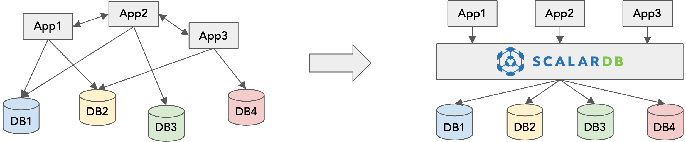

---
tags:
  - Community
  - Enterprise Standard
  - Enterprise Premium
displayed_sidebar: docsJapanese
---

# ScalarDB の概要

import TranslationBanner from '/src/components/_translation-ja-jp.mdx';

<TranslationBanner />

このページでは、ScalarDB の概要と主な使用例について説明します。

## ScalarDB とは

ScalarDB は、さまざまなデータベース向けのユニバーサルなハイブリッドトランザクション/分析処理 (HTAP) エンジンです。データベース上でミドルウェアとして実行され、ACID トランザクションとリアルタイム分析を実現することでさまざまなデータベースを仮想的に統合し、複数のデータベースまたは単一のデータベースの複数のインスタンスの管理の複雑さを簡素化します。

多用途のソリューションである ScalarDB は、次のようなさまざまなデータベースをサポートしています。

- MariaDB、Microsoft SQL Server、MySQL、Oracle Database、PostgreSQL、SQLite などの JDBC をサポートするリレーショナルデータベース、および Amazon Aurora、YugabyteDB などの互換性のあるデータベース。
- Amazon DynamoDB、Apache Cassandra、Azure Cosmos DB などの NoSQL データベース。

ScalarDB がサポートするデータベースの詳細については、[データベース](requirements.mdx#データベース) を参照してください。

## ScalarDB を選ぶ理由

グローバルトランザクションマネージャー、データフェデレーションエンジン、HTAP システムなどのいくつかのソリューションは、同様の目標を持っていますが、次の観点で制限があります。

- グローバルトランザクションマネージャー (Oracle MicroTx や Atomikos など) は、限られた異種データベースセット (XA 準拠のデータベースのみなど) でトランザクションを実行するように設計されています。
- データフェデレーションエンジン (Denodo や Starburst など) は、異種データベースで分析クエリを実行するように設計されています。
- HTAP システム (TiDB や SingleStore など) は、同種データベースでのみトランザクションと分析クエリの両方を実行します。

言い換えれば、これらはデータベースを仮想的に統合しますが、制限があります。たとえば、データフェデレーションエンジンを使用すると、ユーザーは複数のデータベースにまたがる仮想ビューで読み取り専用の分析クエリを実行できます。ただし、多くの場合、データベースごとに更新クエリを個別に実行する必要があります。

他のソリューションとは異なり、ScalarDB は、異種データベースでトランザクションクエリと分析クエリの両方を実行できる機能を備えているため、データベース管理を大幅に簡素化できます。

次の表は、ScalarDB が他のソリューションとどのように異なるかをまとめたものです。

|                                                                  |              異種データベース間のトランザクション                                     | 異種データベース間の分析               |
| :--------------------------------------------------------------: | :----------------------------------------------------------------------------: | :--------------------------------: |
| グローバルトランザクションマネージャー (Oracle MicroTx や Atomikos など) | はい（ただし、既存のソリューションでは限られたデータベースのセットしかサポートされていません） |                 いいえ              |
|      データフェデレーションエンジン (Denodo や Starburst など)         |                                  いいえ                                         |                  はい               |
|             HTAP システム (TiDB や SingleStore など)                |                いいえ (同種のデータベースのみサポート)                               |  いいえ (同種のデータベースのみサポート)  |
|                          **ScalarDB**                            |                 **はい (各種データベースに対応)**                                   |                **はい**             |

## ScalarDB の使用例

ScalarDB はさまざまな用途で使用できます。ScalarDB の主な使用例を3つ紹介します。

### サイロ化されたデータベースを簡単に管理

多くの企業は、アジャイルなビジネスオペレーションをサポートするために複数の組織、部門、ビジネスユニットで構成されており、その結果、サイロ化された情報システムになることがよくあります。特に、異なる組織では、異なるデータベースを使用して異なるアプリケーションを管理する可能性があります。このようなサイロ化されたデータベースの管理は、アプリケーションが各データベースと個別に通信し、データベース間の違いを適切に処理する必要があるため、困難です。

ScalarDB は、統一されたインターフェイスを使用してサイロ化されたデータベースの管理を簡素化し、ユーザーがデータベースを1つのデータベースのように扱えるようにします。たとえば、ユーザーは複数のデータベースに対して (分析的な) 結合クエリを、それぞれのデータベースとやり取りすることなく実行できます。

### 複数のデータベース間の一貫性の管理

マイクロサービスアーキテクチャなどの最新のアーキテクチャでは、システムでサービスとそのデータベースを小さなサブセットに分割して、システムのモジュール性と開発効率を高めることが推奨されています。しかし、多様なデータベース、特に異なる種類のデータベースを管理するのは困難です。なぜなら、Saga や TCC などのトランザクション管理パターンを使用しても、アプリケーションはそれらのデータベースの正しい状態 (言い換えれば一貫性) を保証する必要があるからです。

ScalarDB は、正確性の保証 (言い換えれば、厳密なシリアル化可能性を備えた ACID) によって、このような多様なデータベースの管理を簡素化します。これにより、データベース間の一貫性の保証を気にすることなく、アプリケーション開発に集中できます。

### データメッシュでのデータ管理の簡素化

企業は、データ利用を合理化および拡張するために、[データメッシュ](https://martinfowler.com/articles/data-mesh-principles.html)の構築に時間を費やしてきました。ただし、データメッシュの構築は必ずしも簡単ではありません。たとえば、分散データの管理方法には多くの技術的な問題があります。

ScalarDB は、データメッシュ内のすべてのデータベースに統一された API を提供することで、データメッシュ内の分散データベースの管理を簡素化し「データをプロダクトとして扱う（Data as a Product）」という原則に簡単に適合させます。

### データベース移行のハードルを下げる

アプリケーションは、データベースが提供する特定の機能のために、特定のデータベースを使用するようにロックされる傾向があります。このようなデータベースロックインにより、データベースのアップグレードや変更が妨げられます。アップグレードや変更を行うには、多くの場合、アプリケーションの書き直しが必要になるからです。

ScalarDB は、多様なデータベースに統一されたインターフェイスを提供します。したがって、ScalarDB インターフェイスを使用してアプリケーションを作成すると、そのアプリケーションは移植可能になり、アプリケーションを書き直すことなくシームレスなデータベース移行を実現できます。

## さらに読む

- [ScalarDB Technical Overview](https://speakerdeck.com/scalar/scalar-db-universal-transaction-manager)
- [ScalarDB Research Paper [VLDB'23]](https://dl.acm.org/doi/10.14778/3611540.3611563)