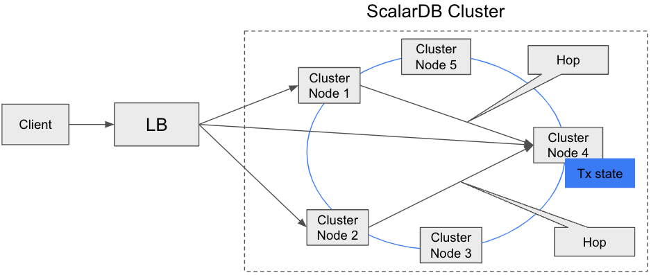
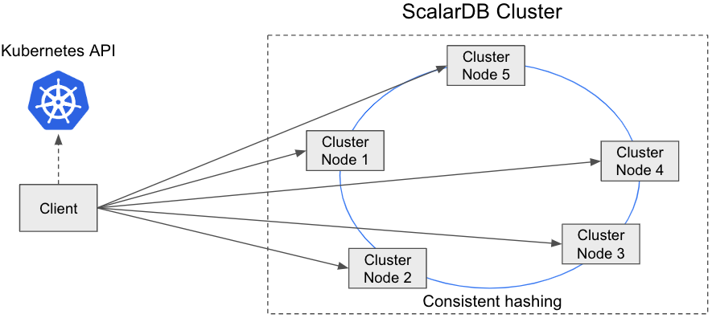

---
tags:
  - Enterprise Standard
  - Enterprise Premium
displayed_sidebar: docsJapanese
---

# Java API を使用した ScalarDB Cluster の開発者ガイド

import TranslationBanner from '/src/components/_translation-ja-jp.mdx';

<TranslationBanner />

ScalarDB Cluster は、アプリケーションを開発するための Java API を提供します。このドキュメントでは、Java API の使用方法を説明します。

## ビルドに ScalarDB Cluster Java Client SDK を追加する

ScalarDB Cluster Java Client SDK は、[Maven Central Repository](https://mvnrepository.com/artifact/com.scalar-labs/scalardb-cluster-java-client-sdk) で入手できます。

Gradle を使用して ScalarDB Cluster Java Client SDK への依存関係を追加するには、以下を使用します。

```gradle
dependencies {
  implementation 'com.scalar-labs:scalardb-cluster-java-client-sdk:3.17.4'
}
```

Maven を使用して依存関係を追加するには、以下を使用します。

```xml
<dependency>
  <groupId>com.scalar-labs</groupId>
  <artifactId>scalardb-cluster-java-client-sdk</artifactId>
  <version>3.17.4</version>
</dependency>
```

## クライアントモード

ScalarDB Cluster Java Client SDK は、`indirect` と `direct-kubernetes` の2つのクライアントモードをサポートしています。以下では、クライアントモードについて説明します。

### `indirect` クライアントモード

このモードでは、単にリクエストを任意のクラスターノードに送信します (通常は Envoy などのロードバランサー経由)。リクエストを受信したクラスターノードは、トランザクション状態を持つ適切なクラスターノードにリクエストをルーティングします。



このモードの利点は、クライアントを軽量に保てることです。
欠点は、正しいクラスターノードに到達するために追加のホップが必要になり、パフォーマンスに影響する可能性があることです。

アプリケーションが別の Kubernetes クラスターで実行されていて、アプリケーションが Kubernetes API と各クラスターノードにアクセスできない場合でも、この接続モードを使用できます。
アプリケーションが ScalarDB Cluster ノードと同じ Kubernetes クラスターで実行されている場合は、`direct-kubernetes` クライアントモードを使用できます。

### `direct-kubernetes` クライアントモード

このモードでは、クライアントはメンバーシップロジック (Kubernetes API を使用) と分散ロジック (コンシステントハッシュアルゴリズム) を使用して、トランザクション状態を持つ適切なクラスターノードを見つけます。次に、クライアントはクラスターノードに直接リクエストを送信します。



このモードの利点は、適切なクラスターノードに到達するためのホップ数を減らすことができるため、パフォーマンスが向上することです。このモードの欠点は、クライアントにメンバーシップロジックとリクエストルーティングロジックが必要なため、クライアントをファットにする必要があることです。

この接続モードは Kubernetes API と各クラスターノードにアクセスする必要があるため、アプリケーションが ScalarDB Cluster ノードと同じ Kubernetes クラスターで実行されている場合にのみ、この接続モードを使用できます。アプリケーションが別の Kubernetes クラスターで実行されている場合は、`indirect` クライアントモードを使用します。

`direct-kubernetes` クライアントモードで Kubernetes にアプリケーションをデプロイする方法の詳細については、[`direct-kubernetes` モードを使用してクライアントアプリケーションを Kubernetes にデプロイする](../helm-charts/how-to-deploy-scalardb-cluster.mdx#direct-kubernetes-モードを使用してクライアント-アプリケーションを-kubernetes-にデプロイします) を参照してください。

## Java API リファレンス

ScalarDB Cluster Java Client SDK は、アプリケーションが ScalarDB Cluster にアクセスするための Java API を提供します。次の図は、ScalarDB Cluster Java API のアーキテクチャを示しています。

```
  +-----------------------+
  | ユーザー/アプリケーション |
  +-----------------------+
           ↓ Java API
    +--------------+
    | ScalarDB API |
    +--------------+
           ↓ gRPC
  +------------------+
  | ScalarDB Cluster |
  +------------------+
           ↓ DB ベンダー固有のプロトコル
         +----+
         | DB |
         +----+
```

ScalarDB Cluster の詳細な Java API リファレンスは、[ScalarDB Cluster Java API ガイド](./api-guide.mdx) で入手できます。

次のセクションでは、ScalarDB Cluster Schema Loader について説明します。

### ScalarDB Cluster Schema Loader

ScalarDB Cluster 経由でスキーマをロードするには、専用の ScalarDB Cluster Schema Loader を使用します。ScalarDB Cluster Schema Loader の使用方法は、成果物 (アーティファクト) の名前が異なることを除いて、[ScalarDB Schema Loader](../schema-loader.mdx) の使用方法と同じです。

ScalarDB Cluster Schema Loader は [ScalarDB リリース](https://github.com/scalar-labs/scalardb/releases/tag/v3.17.4) からダウンロードし、次のように実行できます。

```console
java -jar scalardb-cluster-schema-loader-3.17.4-all.jar --config <PATH_TO_SCALARDB_PROPERTIES_FILE> --schema-file <PATH_TO_SCHEMA_FILE> --coordinator
```

[Scalar コンテナレジストリ](https://github.com/orgs/scalar-labs/packages/container/package/scalardb-cluster-schema-loader) のコンテナイメージを使用することもできます:

```console
docker run --rm -v <PATH_TO_YOUR_LOCAL_SCALARDB_PROPERTIES_FILE>:/scalardb.properties -v <PATH_TO_YOUR_LOCAL_SCHEMA_FILE>:/schema.json ghcr.io/scalar-labs/scalardb-cluster-schema-loader:3.17.4 --config /scalardb.properties --schema-file /schema.json --coordinator
```

## Java での ScalarDB Cluster SQL

ScalarDB Cluster は、JDBC および Spring Data JDBC for ScalarDB を介して、ScalarDB Cluster SQL への Java アクセスも提供します。次の図は、ScalarDB Cluster SQL へのアクセス方法を示しています。

```
  +----------------------------------------------+
  |            ユーザー/アプリケーション             |
  +----------------------------------------------+
         ↓                    ↓ Java API
Java API ↓     +-------------------------------+
 (JDBC)  ↓     | Spring Data JDBC for ScalarDB |
         ↓     +-------------------------------+
+----------------------------------------------+
|         ScalarDB JDBC (ScalarDB SQL)         |
+----------------------------------------------+
                    ↓ gRPC
         +----------------------+
         | ScalarDB Cluster SQL |
         +----------------------+
                    ↓ DB ベンダー固有のプロトコル
                  +----+
                  | DB |
                  +----+
```

### JDBC 経由の ScalarDB Cluster SQL

JDBC 経由での ScalarDB Cluster SQL の使用は、ScalarDB Cluster の依存関係を追加する必要がある点を除いて、[ScalarDB JDBC](../scalardb-sql/jdbc-guide.mdx) を使用する場合とほぼ同じです。

Gradle を使用して依存関係を追加するには、以下を使用します。

```gradle
dependencies {
  implementation 'com.scalar-labs:scalardb-sql-jdbc:3.17.4'
  implementation 'com.scalar-labs:scalardb-cluster-java-client-sdk:3.17.4'
}
```

Maven を使用して依存関係を追加するには、以下を使用します。

```xml
<dependencies>
  <dependency>
    <groupId>com.scalar-labs</groupId>
    <artifactId>scalardb-sql-jdbc</artifactId>
    <version>3.17.4</version>
  </dependency>
  <dependency>
    <groupId>com.scalar-labs</groupId>
    <artifactId>scalardb-cluster-java-client-sdk</artifactId>
    <version>3.17.4</version>
  </dependency>
</dependencies>
```

詳細については、[ScalarDB JDBC ガイド](../scalardb-sql/jdbc-guide.mdx) を参照してください。

### Spring Data JDBC for ScalarDB 経由の ScalarDB Cluster SQL

Spring Data JDBC for ScalarDB 経由での ScalarDB Cluster SQL の使用は、ScalarDB Cluster の依存関係を追加する必要がある点を除いて、[Spring Data JDBC for ScalarDB](../scalardb-sql/spring-data-guide.mdx) を使用することとほぼ同じです。

Gradle を使用して依存関係を追加するには、以下を使用します。

```gradle
dependencies {
  implementation 'com.scalar-labs:scalardb-sql-spring-data:3.17.4'
  implementation 'com.scalar-labs:scalardb-cluster-java-client-sdk:3.17.4'
}
```

Maven を使用して依存関係を追加するには、以下を使用します。

```xml
<dependencies>
  <dependency>
    <groupId>com.scalar-labs</groupId>
    <artifactId>scalardb-sql-spring-data</artifactId>
    <version>3.17.4</version>
  </dependency>
  <dependency>
    <groupId>com.scalar-labs</groupId>
    <artifactId>scalardb-cluster-java-client-sdk</artifactId>
    <version>3.17.4</version>
  </dependency>
</dependencies>
```

詳細については、[Spring Data JDBC for ScalarDB ガイド](../scalardb-sql/spring-data-guide.mdx) を参照してください。

### ScalarDB Cluster SQL CLI

他の SQL データベースと同様に、ScalarDB SQL には、コマンドラインシェルで対話的に SQL ステートメントを発行できる CLI ツールが用意されています。

ScalarDB Cluster SQL CLI は、[ScalarDB リリース](https://github.com/scalar-labs/scalardb/releases/tag/v3.17.4) からダウンロードし、次のように実行できます。

```console
java -jar scalardb-cluster-sql-cli-3.17.4-all.jar --config <PATH_TO_SCALARDB_SQL_PROPERTIES_FILE>
```

[Scalar コンテナレジストリ](https://github.com/orgs/scalar-labs/packages/container/package/scalardb-cluster-sql-cli) のコンテナイメージを使用することもできます:

```console
docker run --rm -it -v <PATH_TO_YOUR_LOCAL_SCALARDB_SQL_PROPERTIES_FILE>:/scalardb-sql.properties ghcr.io/scalar-labs/scalardb-cluster-sql-cli:3.17.4 --config /scalardb-sql.properties
```

#### 使用方法

CLI の使用方法は、次のように `-h` オプションを使用して確認できます。

```console
java -jar scalardb-cluster-sql-cli-3.17.4-all.jar -h
Usage: scalardb-sql-cli [-hs] -c=PROPERTIES_FILE [-e=COMMAND] [-f=FILE]
                        [-l=LOG_FILE] [-o=<outputFormat>] [-p=PASSWORD]
                        [-u=USERNAME]
Starts ScalarDB SQL CLI.
  -c, --config=PROPERTIES_FILE
                            A configuration file in properties format.
  -e, --execute=COMMAND     A command to execute.
  -f, --file=FILE           A script file to execute.
  -h, --help                Display this help message.
  -l, --log=LOG_FILE        A file to write output.
  -o, --output-format=<outputFormat>
                            Format mode for result display. You can specify
                              table/vertical/csv/tsv/xmlattrs/xmlelements/json/a
                              nsiconsole.
  -p, --password=PASSWORD   A password to connect.
  -s, --silent              Reduce the amount of informational messages
                              displayed.
  -u, --username=USERNAME   A username to connect.
```

## 参考資料

Java 以外のプログラミング言語で ScalarDB Cluster を使用する場合は、ScalarDB Cluster gRPC API を使用できます。
詳細については、以下を参照してください。

* [ScalarDB Cluster gRPC API ガイド](scalardb-cluster-grpc-api-guide.mdx)
* [ScalarDB Cluster SQL gRPC API ガイド](scalardb-cluster-sql-grpc-api-guide.mdx)

Javadocs も利用可能です:

* [ScalarDB Cluster Java Client SDK](https://javadoc.io/doc/com.scalar-labs/scalardb-cluster-java-client-sdk/3.17.4/index.html)
* [ScalarDB Cluster Common](https://javadoc.io/doc/com.scalar-labs/scalardb-cluster-common/3.17.4/index.html)
* [ScalarDB Cluster RPC](https://javadoc.io/doc/com.scalar-labs/scalardb-cluster-rpc/3.17.4/index.html)
