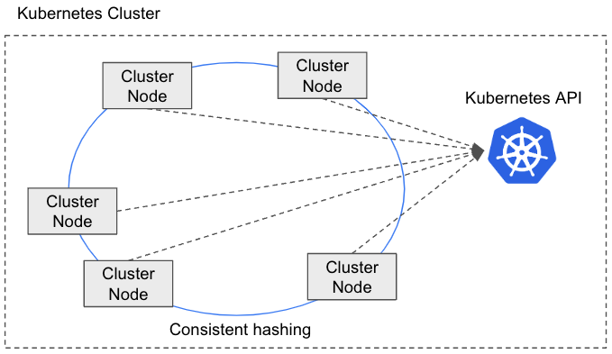

# ScalarDB Cluster

ScalarDB Cluster is a clustering solution for [ScalarDB](https://github.com/scalar-labs/scalardb) that consists of a set of cluster nodes, each of which provides ScalarDB functionality. Each cluster node has a routing mechanism that directs transaction requests to the appropriate cluster node within the cluster.

## Why ScalarDB Cluster?

When executing a transaction that spans multiple client requests, such as in microservice transactions, all requests for the transaction must be processed on the same server due to the stateful nature of transaction processing. However, in a distributed environment, routing requests to the same server isn't straightforward because a service typically runs on multiple servers (or hosts) for scalability and availability. In this scenario, all requests within a transaction must be routed to the same server, while different transactions should be distributed to ensure load balancing.

To address this challenge, a routing mechanism such as session affinity (also known as sticky sessions) needs to be configured. This strategy ensures that requests within a transaction are consistently routed to the same server. Alternatively, you can leverage a bidirectional-streaming RPC by using gRPC. However, it's important to note that implementing these configurations typically requires significant time and effort. In addition, specific configuration adjustments may be required depending on the load balancer product you are using.

For more details on this topic, see [Request routing in transactions with a two-phase commit interface](https://github.com/scalar-labs/scalardb/blob/master/docs/two-phase-commit-transactions.md#request-routing-in-transactions-with-a-two-phase-commit-interface).

ScalarDB Cluster addresses this issue by providing a routing mechanism capable of directing requests to the appropriate cluster node within the cluster. Thus, when a cluster node receives a request, the node can route that request to the correct cluster node in the cluster.

## Architecture

ScalarDB Cluster consists of a set of cluster nodes, each equipped with ScalarDB functionality. By using this solution, each cluster node can execute transactions independently.

A notable feature of ScalarDB Cluster is the distribution of transaction requests by using a routing mechanism. When a cluster node receives a request, the node determines whether it's the appropriate cluster node to process the request. If it's not the appropriate node, the node routes the request to the appropriate cluster node within the cluster. To determine the appropriate cluster node, ScalarDB Cluster uses a consistent hashing algorithm.

Membership management plays a critical role in ScalarDB Cluster. When a cluster node either joins or leaves the cluster, the configuration of the cluster is automatically adjusted to reflect this change. ScalarDB Cluster currently retrieves membership information by using the Kubernetes API.

:::note

Currently, ScalarDB Cluster supports running on Kubernetes only.

:::

## Getting started

Before you start the tutorials, you need to set up ScalarDB Cluster. To set up ScalarDB Cluster, see [Set Up ScalarDB Cluster on Kubernetes by Using a Helm Chart](setup-scalardb-cluster-on-kubernetes-by-using-helm-chart.mdx).

For tutorials on getting started with ScalarDB Cluster, see the following:

* [Getting Started with ScalarDB Cluster](getting-started-with-scalardb-cluster.mdx)
* [Getting Started with ScalarDB Cluster GraphQL](getting-started-with-scalardb-cluster-graphql.mdx)
* [Getting Started with ScalarDB Cluster SQL via JDBC](getting-started-with-scalardb-cluster-sql-jdbc.mdx)
* [Getting Started with ScalarDB Cluster SQL via Spring Data JDBC for ScalarDB](getting-started-with-scalardb-cluster-sql-spring-data-jdbc.mdx)

## References

For details about the ScalarDB Cluster Helm Chart, refer to the following:

* [ScalarDB Cluster Helm Chart](https://github.com/scalar-labs/helm-charts/tree/main/charts/scalardb-cluster)
* [Deploy Scalar products using Scalar Helm Charts](https://github.com/scalar-labs/helm-charts/blob/main/docs/how-to-deploy-scalar-products.mdx)
* [How to deploy ScalarDB Cluster](https://github.com/scalar-labs/helm-charts/blob/main/docs/how-to-deploy-scalardb-cluster.mdx)

For details about the configurations for ScalarDB Cluster, refer to the following:

* [ScalarDB Cluster Configurations](scalardb-cluster-configurations.mdx)

For details about developing applications that use ScalarDB Cluster with the Java API, refer to the following:

* [Developer Guide for ScalarDB Cluster with the Java API](developer-guide-for-scalardb-cluster-with-java-api.mdx)

For details about the ScalarDB Cluster gRPC API, refer to the following:

* [ScalarDB Cluster gRPC API Guide](scalardb-cluster-grpc-api-guide.mdx)
* [ScalarDB Cluster SQL gRPC API Guide](scalardb-cluster-sql-grpc-api-guide.mdx)
