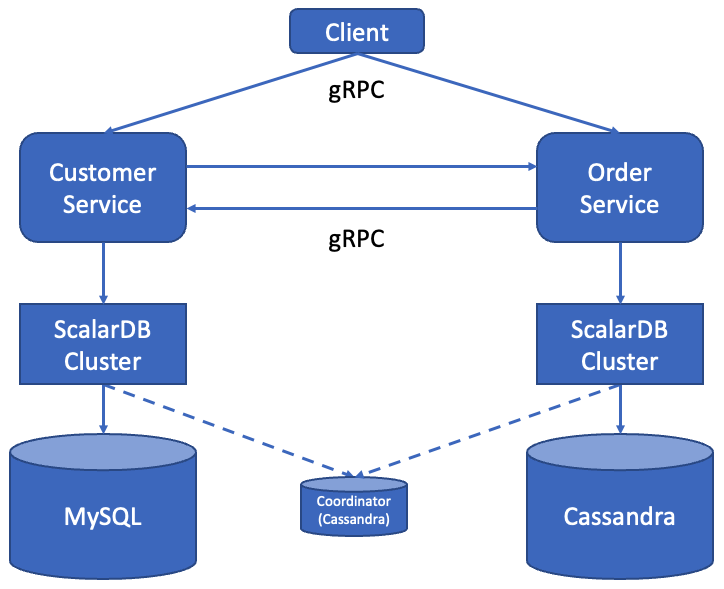
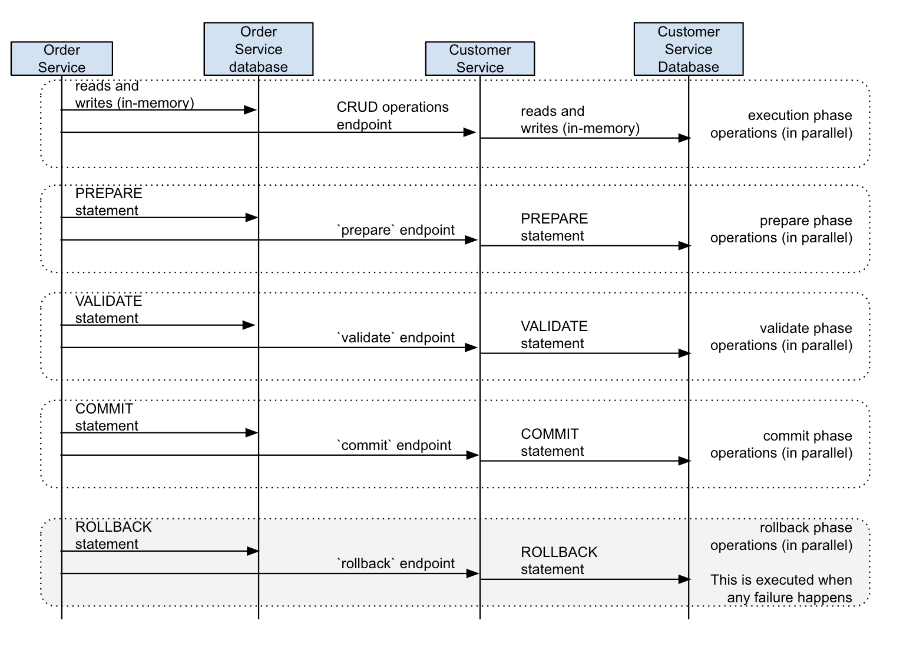

# Sample application of Spring Data JDBC for ScalarDB with Microservice Transactions

This tutorial describes how to create a sample Spring Boot application for microservice transactions by using Spring Data JDBC for ScalarDB.

For details about these features, see [Two-phase Commit Transactions](../../two-phase-commit-transactions.mdx) and [Guide of Spring Data JDBC for ScalarDB](../../scalardb-sql/spring-data-guide.mdx).

## Prerequisites for this sample application

- One of the following Java Development Kits (JDKs):
  - [Oracle JDK](https://www.oracle.com/java/technologies/downloads/) 8
  - OpenJDK 8 from [Eclipse Temurin](https://adoptium.net/temurin/releases/), [Amazon Corretto](https://aws.amazon.com/corretto/), or [Microsoft](https://learn.microsoft.com/en-us/java/openjdk/download)
- [Docker](https://www.docker.com/get-started/) 20.10 or later with [Docker Compose](https://docs.docker.com/compose/install/) V2 or later

:::note

This sample application only works with Java 8. However, ScalarDB itself works with Java LTS versions, which means that you can use Java LTS versions for your application that uses ScalarDB. For details on the requirements of ScalarDB, such as which Java versions can be used, see [Requirements](../../requirements.mdx).

:::

Also, you need to have a license key (trial license or commercial license) for ScalarDB Cluster. If you don't have a license key, please [contact us](https://www.scalar-labs.com/contact).

## Sample application

### Overview

This tutorial illustrates the process of creating a sample e-commerce application, where items can be ordered and paid for with a line of credit through [transactions with a two-phase commit interface](../../two-phase-commit-transactions.mdx) in ScalarDB.

There are two microservices called the *Customer Service* and the *Order Service* based on the [*Database-per-service* pattern](https://microservices.io/patterns/data/database-per-service.html) in this sample application.

The Customer Service manages customers' information including credit card information like a credit limit and a credit total.
The Order Service is responsible for order operations like placing an order and getting order histories.
Each service has gRPC endpoints. Clients call the endpoints, and the services call the endpoints each other as well.
The Customer Service and the Order Service use MySQL and Cassandra through ScalarDB, respectively.



Each service accesses the databases through its own dedicated ScalarDB Cluster.

:::note
Both ScalarDB Clusters access a small coordinator database used for the Consensus Commit protocol. In this sample application, for ease of setup and explanation, the coordinator database is co-located in the same Cassandra instance of the Order Service, but of course, the coordinator database can be managed as a separate database. 

Also, application-specific error handling, authentication processing, etc. are omitted in the sample application since it focuses on explaining how to use ScalarDB.
For details about handling exceptions in ScalarDB, see [How to handle exceptions](../../two-phase-commit-transactions.mdx#how-to-handle-exceptions).

:::

### Service endpoints

The endpoints defined in the services are as follows:

- Customer Service
  - `getCustomerInfo`
  - `payment`
  - `prepare`
  - `validate`
  - `commit`
  - `rollback`
  - `repayment`

- Order Service
  - `placeOrder`
  - `getOrder`
  - `getOrders`

### What you can do in this sample application

The sample application supports the following types of transactions:

- Get customer information through the `getCustomerInfo` endpoint of the Customer Service.
- Place an order by using a line of credit through the `placeOrder` endpoint of the Order Service and the `payment`, `prepare`, `validate`, `commit`, and `rollback` endpoints of the Customer Service.
  - Checks if the cost of the order is below the customer's credit limit.
  - If the check passes, records the order history and updates the amount the customer has spent.
- Get order information by order ID through the `getOrder` endpoint of the Order Service and the `getCustomerInfo`, `prepare`, `validate`, `commit`, and `rollback` endpoints of the Customer Service.
- Get order information by customer ID through the `getOrders` endpoint of the Order Service and the `getCustomerInfo`, `prepare`, `validate`, `commit`, and `rollback` endpoints of the Customer Service.
- Make a payment through the `repayment` endpoint of the Customer Service.
  - Reduces the amount the customer has spent.

:::note

The `getCustomerInfo` endpoint works as a participant service endpoint when receiving a transaction ID from the coordinator.

:::

## Configuration for ScalarDB Cluster

[The configuration for ScalarDB Cluster for the Customer Service](https://github.com/scalar-labs/scalardb-samples/blob/main/spring-data-microservice-transaction-sample/scalardb-cluster-node-for-customer-service.properties) is as follows:

```properties
scalar.db.storage=multi-storage
scalar.db.multi_storage.storages=cassandra,mysql
scalar.db.multi_storage.storages.cassandra.storage=cassandra
scalar.db.multi_storage.storages.cassandra.contact_points=cassandra-1
scalar.db.multi_storage.storages.cassandra.username=cassandra
scalar.db.multi_storage.storages.cassandra.password=cassandra
scalar.db.multi_storage.storages.mysql.storage=jdbc
scalar.db.multi_storage.storages.mysql.contact_points=jdbc:mysql://mysql-1:3306/
scalar.db.multi_storage.storages.mysql.username=root
scalar.db.multi_storage.storages.mysql.password=mysql
scalar.db.multi_storage.namespace_mapping=customer_service:mysql,coordinator:cassandra
scalar.db.multi_storage.default_storage=mysql
scalar.db.consensus_commit.isolation_level=SERIALIZABLE

scalar.db.cluster.node.standalone_mode.enabled=true
scalar.db.sql.enabled=true

# License key configurations
scalar.db.cluster.node.licensing.license_key=
scalar.db.cluster.node.licensing.license_check_cert_pem=
```

- `scalar.db.sql.connection_mode`: This configuration decides how to connect to ScalarDB.
- `scalar.db.storage`: Specifying `multi-storage` is necessary to use Multi-storage Transactions in ScalarDB.
- `scalar.db.multi_storage.storages`: Your storage names must be defined here.
- `scalar.db.multi_storage.storages.cassandra.*`: These configurations are for the `cassandra` storage, which is one of the storage names defined in `scalar.db.multi_storage.storages`. You can configure all the `scalar.db.*` properties for the `cassandra` storage here.
- `scalar.db.multi_storage.storages.mysql.*`: These configurations are for the `mysql` storage, which is one of the storage names defined in `scalar.db.multi_storage.storages`. You can configure all the `scalar.db.*` properties for the `mysql` storage here.
- `scalar.db.multi_storage.namespace_mapping`: This configuration maps the namespaces to the storage. In this sample application, operations for `customer_service` namespace tables are mapped to the `mysql` storage and operations for `order_service` namespace tables are mapped to the `cassandra` storage. You can also define which storage is mapped for the `coordinator` namespace that is used in Consensus Commit transactions.
- `scalar.db.multi_storage.default_storage`: This configuration sets the default storage that is used for operations on unmapped namespace tables.
- `scalar.db.sql.default_transaction_mode`: Specifying `two_phase_commit_transaction` is necessary to use Two-Phase Commit Transactions mode in ScalarDB.
- `scalar.db.consensus_commit.isolation_level`: This configuration decides the isolation level used for ConsensusCommit.

For details, see [Multi-Storage Transactions](../../multi-storage-transactions.mdx).

[The configuration for ScalarDB Cluster for the Order Service](https://github.com/scalar-labs/scalardb-samples/blob/main/spring-data-microservice-transaction-sample/scalardb-cluster-node-for-order-service.properties) is as follows:

```properties
scalar.db.storage=cassandra
scalar.db.contact_points=cassandra-1
scalar.db.username=cassandra
scalar.db.password=cassandra
scalar.db.consensus_commit.isolation_level=SERIALIZABLE

scalar.db.cluster.node.standalone_mode.enabled=true
scalar.db.sql.enabled=true

# License key configurations
scalar.db.cluster.node.licensing.license_key=
scalar.db.cluster.node.licensing.license_check_cert_pem=
```

- `scalar.db.storage`: `cassandra` is specified since this servcise uses only Cassandra as an underlying database.
- `scalar.db.contact_points`: This configuration specifies the contact points (e.g., host) for connecting to Cassandra.
- `scalar.db.username`: This configuration specifies the username for connecting to Cassandra.
- `scalar.db.password`: This configuration specifies the password for connecting to Cassandra.
- `scalar.db.sql.default_namespace_name`: This configuration sets the default namespace to `order_service`, eliminating the need for the application to specify namespaces.
- `scalar.db.sql.default_transaction_mode`: Specifying `two_phase_commit_transaction` is necessary to use Two-Phase Commit Transactions mode in ScalarDB.
- `scalar.db.consensus_commit.isolation_level`: This configuration decides the isolation level used for ConsensusCommit.

In this sample application, the ScalarDB Clusters are running in standalone mode (`scalar.db.cluster.node.standalone_mode.enabled=true`).

Also, you need to set the license key (trial license or commercial license) for the ScalarDB Clusters in the configuration file. For details, see [How to Configure a Product License Key](../../scalar-licensing/index.mdx).

## Setup

### Clone the ScalarDB samples repository

Open Terminal, then clone the ScalarDB samples repository by running the following command:

```shell
$ git clone https://github.com/scalar-labs/scalardb-samples
```

Then, go to the directory with this sample by running the following command:

```shell
$ cd scalardb-samples/spring-data-microservice-transaction-sample
```

### Set the license key

Set the license key (trial license or commercial license) for the ScalarDB Clusters in the configuration files [`scalardb-cluster-node-for-customer-service.properties`](https://github.com/scalar-labs/scalardb-samples/blob/main/spring-data-microservice-transaction-sample/scalardb-cluster-node-for-customer-service.properties) and [`scalardb-cluster-node-for-order-service.properties`](https://github.com/scalar-labs/scalardb-samples/blob/main/spring-data-microservice-transaction-sample/scalardb-cluster-node-for-order-service.properties). For details, see [How to Configure a Product License Key](../../scalar-licensing/index.mdx).

### Start Cassandra, MySQL, and ScalarDB Clusters

To start Cassandra, MySQL, and ScalarDB Clusters, you need to run the following `docker-compose` command:

```shell
$ docker-compose up -d cassandra mysql scalardb-cluster-node-for-customer-service scalardb-cluster-node-for-order-service
```

:::note

You will need to wait more than one minute for the containers to be fully started.

:::

### Load schema

The database schema (the method in which the data will be organized) for the sample application has already been defined in [`schema-for-customer-service.sql`](https://github.com/scalar-labs/scalardb-samples/blob/main/spring-data-microservice-transaction-sample/schema-for-customer-service.sql) for the Customer Service and [`schema-for-order-service.sql`](https://github.com/scalar-labs/scalardb-samples/blob/main/spring-data-microservice-transaction-sample/schema-for-order-service.sql) for the Order Service.

To apply the schema, go to the [ScalarDB Releases](https://github.com/scalar-labs/scalardb/releases) page and download the SQL CLI tool that matches the version of ScalarDB that you want to use.

#### MySQL

To load the schema for [`schema-for-customer-service.sql`](https://github.com/scalar-labs/scalardb-samples/blob/main/spring-data-microservice-transaction-sample/schema-for-customer-service.sql) into MySQL, run the following command, replacing `<VERSION>` with the version of the ScalarDB Schema Loader that you downloaded:

```console
$ java -jar scalardb-cluster-sql-cli-<VERSION>-all.jar --config scalardb-cluster-node-for-customer-service-client.properties --file schema-for-customer-service.sql
```

#### Cassandra

To load the schema for [`schema-for-order-service.sql`](https://github.com/scalar-labs/scalardb-samples/blob/main/spring-data-microservice-transaction-sample/schema-for-order-service.sql) into Cassandra, run the following command, replacing `<VERSION>` with the version of the ScalarDB Schema Loader that you downloaded:

```console
$ java -jar scalardb-cluster-sql-cli-<VERSION>-all.jar --config scalardb-cluster-node-for-order-service-client.properties --file schema-for-order-service.sql
```

#### Schema details

As shown in [`schema-for-customer-service.sql`](https://github.com/scalar-labs/scalardb-samples/blob/main/spring-data-microservice-transaction-sample/schema-for-customer-service.sql), all the tables for the Customer Service are created in the `customer_service` namespace.

- `customer_service.customers`: a table that manages customers' information
  - `credit_limit`: the maximum amount of money a lender will allow each customer to spend when using a line of credit
  - `credit_total`: the amount of money that each customer has already spent by using their line of credit

As shown in [`schema-for-order-service.sql`](https://github.com/scalar-labs/scalardb-samples/blob/main/spring-data-microservice-transaction-sample/schema-for-order-service.sql), all the tables for the Order Service are created in the `order_service` namespace.

- `order_service.orders`: a table that manages order information
- `order_service.statements`: a table that manages order statement information
- `order_service.items`: a table that manages information of items to be ordered

The Entity Relationship Diagram for the schema is as follows:


### Start Microservices

First, you need to build the docker images of the sample application with the following command:

```shell
$ ./gradlew docker
```

Then, you can start the microservices with the following `docker-compose` command:

```shell
$ docker-compose up -d customer-service order-service
```

### Initial data

When the microservices start, the initial data is loaded automatically.

After the initial data has loaded, the following records should be stored in the tables:

- For the `customer_service.customers` table:

| customer_id | name          | credit_limit | credit_total |
|-------------|---------------|--------------|--------------|
| 1           | Yamada Taro   | 10000        | 0            |
| 2           | Yamada Hanako | 10000        | 0            |
| 3           | Suzuki Ichiro | 10000        | 0            |

- For the `order_service.items` table:

| item_id | name   | price |
|---------|--------|-------|
| 1       | Apple  | 1000  |
| 2       | Orange | 2000  |
| 3       | Grape  | 2500  |
| 4       | Mango  | 5000  |
| 5       | Melon  | 3000  |

## Run the sample application

Let's start with getting information about the customer whose ID is `1`:

```shell
$ ./gradlew :client:run --args="GetCustomerInfo 1"
...
{"id": 1,"name": "Yamada Taro","credit_limit": 10000}
...
```

At this time, `credit_total` isn't shown, which means the current value of `credit_total` is `0`.

Then, place an order for three apples and two oranges by using customer ID `1`.
Note that the order format is `<Item ID>:<Count>,<Item ID>:<Count>,...`:

```shell
$ ./gradlew :client:run --args="PlaceOrder 1 1:3,2:2"
...
{"order_id": "415a453b-cfee-4c48-b8f6-d103d3e10bdb"}
...
```

You can see that running this command shows the order ID.

Let's check the details of the order by using the order ID:

```shell
$ ./gradlew :client:run --args="GetOrder 415a453b-cfee-4c48-b8f6-d103d3e10bdb"
...
{"order": {"order_id": "415a453b-cfee-4c48-b8f6-d103d3e10bdb","timestamp": 1686555272435,"customer_id": 1,"customer_name": "Yamada Taro","statement": [{"item_id": 1,"item_name": "Apple","price": 1000,"count": $
,"total": 3000},{"item_id": 2,"item_name": "Orange","price": 2000,"count": 2,"total": 4000}],"total": 7000}}
...
```

Then, let's place another order and get the order history of customer ID `1`:

```shell
$ ./gradlew :client:run --args="PlaceOrder 1 5:1"
...
{"order_id": "069be075-98f7-428c-b2e0-6820693fc41b"}
...
$ ./gradlew :client:run --args="GetOrders 1"
...
{"order": [{"order_id": "069be075-98f7-428c-b2e0-6820693fc41b","timestamp": 1686555279366,"customer_id": 1,"customer_name": "Yamada Taro","statement": [{"item_id": 5,"item_name": "Melon","price": 3000,"count": 1,"total": 3000}],"total": 3000},{"order_id": "415a453b-cfee-4c48-b8f6-d103d3e10bdb","timestamp": 1686555272435,"customer_id": 1,"customer_name": "Yamada Taro","statement": [{"item_id": 1,"item_name": "Apple","price": 1000,"count": 3,"total": 3000},{"item_id": 2,"item_name": "Orange","price": 2000,"count": 2,"total": 4000}],"total": 7000}]}
...
```

This order history is shown in descending order by timestamp.

The customer's current `credit_total` is `10000`.
Since the customer has now reached their `credit_limit`, which was shown when retrieving their information, they cannot place anymore orders.

```shell
$ ./gradlew :client:run --args="GetCustomerInfo 1"
...
{"id": 1,"name": "Yamada Taro","credit_limit": 10000,"credit_total": 10000}
...
$ ./gradlew :client:run --args="PlaceOrder 1 3:1,4:1"
...
io.grpc.StatusRuntimeException: FAILED_PRECONDITION: Credit limit exceeded. creditTotal:10000, payment:7500
        at io.grpc.stub.ClientCalls.toStatusRuntimeException(ClientCalls.java:271)
        at io.grpc.stub.ClientCalls.getUnchecked(ClientCalls.java:252)
        at io.grpc.stub.ClientCalls.blockingUnaryCall(ClientCalls.java:165)
        at sample.rpc.OrderServiceGrpc$OrderServiceBlockingStub.placeOrder(OrderServiceGrpc.java:296)
        at sample.client.command.PlaceOrderCommand.call(PlaceOrderCommand.java:38)
        at sample.client.command.PlaceOrderCommand.call(PlaceOrderCommand.java:12)
        at picocli.CommandLine.executeUserObject(CommandLine.java:2041)
        at picocli.CommandLine.access$1500(CommandLine.java:148)
        at picocli.CommandLine$RunLast.executeUserObjectOfLastSubcommandWithSameParent(CommandLine.java:2461)
        at picocli.CommandLine$RunLast.handle(CommandLine.java:2453)
        at picocli.CommandLine$RunLast.handle(CommandLine.java:2415)
        at picocli.CommandLine$AbstractParseResultHandler.execute(CommandLine.java:2273)
        at picocli.CommandLine$RunLast.execute(CommandLine.java:2417)
        at picocli.CommandLine.execute(CommandLine.java:2170)
        at sample.client.Client.main(Client.java:39)
...
```

After making a payment, the customer will be able to place orders again.

```shell
$ ./gradlew :client:run --args="Repayment 1 8000"
...
$ ./gradlew :client:run --args="GetCustomerInfo 1"
...
{"id": 1,"name": "Yamada Taro","credit_limit": 10000,"credit_total": 2000}
...
$ ./gradlew :client:run --args="PlaceOrder 1 3:1,4:1"
...
{"order_id": "b6adabd8-0a05-4109-9618-3420fea3161f"}
...
```

## Clean up

To stop Cassandra, MySQL and the Microservices, run the following command:

```shell
$ docker-compose down
```

## Reference - How the microservice transaction is achieved

The transactions for placing an order, getting a single order, and getting the history of orders achieve the microservice transaction. This section focuses on how the transactions that span the Customer Service and the Order Service are implemented by placing an order as an example.

The following sequence diagram shows the transaction for placing an order:


### 1. Transaction with a two-phase commit interface is started

When a client sends a request to place an order to the Order Service, `OrderService.placeOrder()` is called, and the microservice transaction starts.

At first, the Order Service starts a transaction with a two-phase commit interface with `ScalarDbTwoPcRepository.executeTwoPcTransaction()` as follows. For reference, see [`OrderService.java`](https://github.com/scalar-labs/scalardb-samples/blob/main/spring-data-microservice-transaction-sample/order-service/src/main/java/sample/order/OrderService.java).

```java
// Start a two-phase commit interface transaction
TwoPcResult<String> result = orderRepository.executeTwoPcTransaction(txId -> {
  ...
}, ...);
```

The actions in [CRUD operations are executed](#2-crud-operations-are-executed), [Transaction is committed by using the two-phase commit protocol](#3-transaction-is-committed-by-using-the-two-phase-commit-protocol), and [Error handling](#error-handling) are automatically performed by the API.

### 2. CRUD operations are executed

After the transaction with a two-phase commit interface starts, CRUD operations are executed by `ScalarDbTwoPcRepository.executeTwoPcTransaction()`. The Order Service puts the order information in the `order_service.orders` table and the detailed information in the `order_service.statements` table as follows. For reference, see [`OrderService.java`](https://github.com/scalar-labs/scalardb-samples/blob/main/spring-data-microservice-transaction-sample/order-service/src/main/java/sample/order/OrderService.java).

```java
// Put the order info into the `orders` table
orderRepository.insert(order);

AtomicInteger amount = new AtomicInteger();
for (ItemOrder itemOrder : request.getItemOrderList()) {
  int itemId = itemOrder.getItemId();
  int count = itemOrder.getCount();
  // Retrieve the item info from the `items` table
  Optional<Item> itemOpt = itemRepository.findById(itemId);
  if (!itemOpt.isPresent()) {
    String message = "Item not found: " + itemId;
    responseObserver.onError(
        Status.NOT_FOUND.withDescription(message).asRuntimeException());
    throw new ScalarDbNonTransientException(message);
  }
  Item item = itemOpt.get();

  int cost = item.price * count;
  // Put the order statement into the `statements` table
  statementRepository.insert(new Statement(itemId, orderId, count));
  // Calculate the total amount
  amount.addAndGet(cost);
}
```

Then, the Order Service calls the `payment` gRPC endpoint of the Customer Service along with the transaction ID. For reference, see [`OrderService.java`](https://github.com/scalar-labs/scalardb-samples/blob/main/spring-data-microservice-transaction-sample/order-service/src/main/java/sample/order/OrderService.java).

```java
customerServiceStub.payment(
  PaymentRequest.newBuilder()
    .setTransactionId(transactionId)
    .setCustomerId(customerId)
    .setAmount(amount)
    .build());
```

The `payment` endpoint of the Customer Service first joins the transaction with `ScalarDbTwoPcRepository.joinTransactionOnParticipant()` as follows. For reference, see [`CustomerService.java`](https://github.com/scalar-labs/scalardb-samples/blob/main/spring-data-microservice-transaction-sample/customer-service/src/main/java/sample/customer/CustomerService.java).

```java
customerRepository.joinTransactionOnParticipant(request.getTransactionId(), ...);
```

The endpoint then gets the customer information and checks if the customer's credit total exceeds the credit limit after the payment. If the credit total does not exceed the credit limit, the endpoint updates the customer's credit total. For reference, see [`CustomerService.java`](https://github.com/scalar-labs/scalardb-samples/blob/main/spring-data-microservice-transaction-sample/customer-service/src/main/java/sample/customer/CustomerService.java).

```java
Customer customer = getCustomer(responseObserver, request.getCustomerId());

int updatedCreditTotal = customer.creditTotal + request.getAmount();
// Check if the credit total exceeds the credit limit after payment
if (updatedCreditTotal > customer.creditLimit) {
  String message = String.format(
      "Credit limit exceeded. creditTotal:%d, payment:%d", customer.creditTotal, request.getAmount());
  responseObserver.onError(
      Status.FAILED_PRECONDITION.withDescription(message).asRuntimeException());
  throw new ScalarDbNonTransientException(message);
}

// Reduce `credit_total` for the customer
customerRepository.update(customer.withCreditTotal(updatedCreditTotal));
```

### 3. Transaction is committed by using the two-phase commit protocol

After the Order Service receives the update that the payment succeeded, the Order Service tries to commit the transaction.

The `ScalarDbTwoPcRepository.executeTwoPcTransaction()` API, which called on the Order Service, automatically performs preparations, validations, and commits of both the local Order Service and the remote Customer Service. These steps are executed sequentially after the above CRUD operations successfully finish. The implementations to invoke `prepare`, `validate`, and `commit` gRPC endpoints of the Customer Service need to be passed as parameters to the API. For reference, see [`OrderService.java`](https://github.com/scalar-labs/scalardb-samples/blob/main/spring-data-microservice-transaction-sample/order-service/src/main/java/sample/order/OrderService.java).

```java
TwoPcResult<PlaceOrderResponse> result = orderRepository.executeTwoPcTransaction(txId ->{
    ...
  },

  Collections.singletonList(
    RemotePrepareCommitPhaseOperations.createSerializable(
      this::callPrepareEndpoint,
      this::callValidateEndpoint,
      this::callCommitEndpoint,
      this::callRollbackEndpoint
    )
  )
);
```



In the `prepare` endpoint of the Customer Service, the endpoint resumes and prepares the transaction by using `ScalarDbTwoPcRepository.prepareTransactionOnParticipant()`. For reference, see [`CustomerService.java`](https://github.com/scalar-labs/scalardb-samples/blob/main/spring-data-microservice-transaction-sample/customer-service/src/main/java/sample/customer/CustomerService.java).

```java
customerRepository.prepareTransactionOnParticipant(request.getTransactionId());
```

In the `validate` endpoint of the Customer Service, the endpoint resumes and validates the transaction by using `ScalarDbTwoPcRepository.validateTransactionOnParticipant()`. For reference, see [`CustomerService.java`](https://github.com/scalar-labs/scalardb-samples/blob/main/spring-data-microservice-transaction-sample/customer-service/src/main/java/sample/customer/CustomerService.java).

```java
customerRepository.validateTransactionOnParticipant(request.getTransactionId());
```

In the `commit` endpoint of the Customer Service, the endpoint resumes and commits the transaction by using `ScalarDbTwoPcRepository.commitTransactionOnParticipant()`. For reference, see [`CustomerService.java`](https://github.com/scalar-labs/scalardb-samples/blob/main/spring-data-microservice-transaction-sample/customer-service/src/main/java/sample/customer/CustomerService.java).

```java
customerRepository.commitTransactionOnParticipant(request.getTransactionId());
```

### Error handling

If an error happens while executing a transaction, `ScalarDbTwoPcRepository.executeTwoPcTransaction()` will automatically roll back the transaction in both the local Order Service and the remote Customer Service. The implementation to invoke the `rollback` gRPC endpoint of the Customer Service also needs to be passed as a parameter to the API with other ones. For reference, see [`OrderService.java`](https://github.com/scalar-labs/scalardb-samples/blob/main/spring-data-microservice-transaction-sample/order-service/src/main/java/sample/order/OrderService.java).

```java
TwoPcResult<PlaceOrderResponse> result = orderRepository.executeTwoPcTransaction(txId ->{
    ...
  },

  Collections.singletonList(
    RemotePrepareCommitPhaseOperations.createSerializable(
      this::callPrepareEndpoint,
      this::callValidateEndpoint,
      this::callCommitEndpoint,
      this::callRollbackEndpoint
    )
  )
);
```

In the `rollback` endpoint of the Customer Service, the endpoint resumes and rolls back the transaction. For reference, see [`CustomerService.java`](https://github.com/scalar-labs/scalardb-samples/blob/main/spring-data-microservice-transaction-sample/customer-service/src/main/java/sample/customer/CustomerService.java).

```java
customerRepository.rollbackTransactionOnParticipant(request.getTransactionId());
```

For details about how to handle exceptions in ScalarDB, see [How to handle exceptions](../../two-phase-commit-transactions.mdx#how-to-handle-exceptions).
