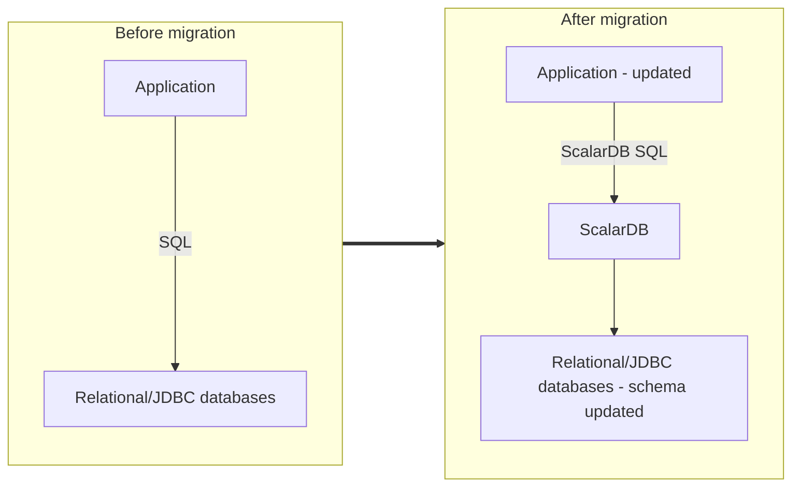

---
tags:
  - Enterprise Premium
---

# How to Migrate Your Applications and Databases into a ScalarDB-Based Environment

This guide describes how to migrate your existing applications and relational databases into ScalarDB-based applications and ScalarDB-managed databases, respectively.

## Target audience

The target audiences for this guide are application developers and database administrators. The purpose of this guide is to help you understand how to migrate your existing applications and databases and in what conditions.

## What you will learn

- Requirements for the migration
- Steps to migrate your application
- Changes to make in your application for the migration

## Steps to migrate your application

1. Verify the items in the checklist.
   - See [Migration checklist](#migration-checklist) to confirm your database is migratable.
2. Migrate your application (if necessary).
   - ScalarDB provides selection, projection, and join operations with dedicated SQL grammar. Thus, some SQL statements in your application might have to be changed for ScalarDB SQL, for example, at a grammar level or a logic level like aggregation processing.
   - For details, see [How to migrate your application](#how-to-migrate-your-application).
3. Back up your database.
   - Although ScalarDB Schema Loader, which you will use to import your database, only changes the metadata of your database when importing it to ScalarDB, you must back it up to avoid unexpected accidents.
   - Follow the administration guide of your database.
4. Set up a ScalarDB environment.
   - Prepare a configuration file so that ScalarDB can access target databases.
   - For details about ScalarDB configurations, see [ScalarDB Configurations](../configurations.mdx).
5. Import your database to ScalarDB.
   - Prepare an import schema file that defines target schemas and tables. The schemas and tables will be mapped to ScalarDB namespaces and tables, respectively. Note that "schema" is a synonym for "database" in some database systems.
   - Run the ScalarDB Schema Loader with the import option, the ScalarDB configuration file that you created, and the schema file that you prepared.
   - For details on how to use Schema Loader, see [Run Schema Loader for importing existing tables](../schema-loader-import.mdx#run-schema-loader-for-importing-existing-tables).
6. Switch your application and check the behavior.
   - Now, you can switch your application to the ScalarDB-based application.

## Migration checklist

Before starting the migration, check the following questions. If the answer to any of these questions is "No", you must address them before proceeding with the migration.

- Are your target database and version one of the [supported relational databases (called JDBC databases in ScalarDB) and versions](../scalardb-supported-databases.mdx#jdbc-databases)?
- Do you have a fully privileged account that can manage the target database? For details, see [the general requirements](../database-configurations.mdx#general-requirements).
- Do all target tables have primary keys?
- Is the data type of each column supported in ScalarDB? For supported data types and how they are mapped to ScalarDB data types, see [Data-type mapping from JDBC databases to ScalarDB](../schema-loader-import.mdx#data-type-mapping-from-jdbc-databases-to-scalardb).
- Do the functionality and grammar of the queries in your application comply with the [ScalarDB SQL specifications](./grammar.mdx)? Or, for non-compliant queries, can you re-write them for ScalarDB? For examples of re-writes, see [How to migrate your application](#how-to-migrate-your-application).
- After migrating your applications and databases into ScalarDB applications and ScalarDB-managed databases, respectively, can you stop accessing the databases directly? In other words, is it acceptable for you to always access the databases through ScalarDB?

## How to migrate your application

Depending on your application environment, you may need to migrate your application in the following three aspects:
 
- Change connection settings.
- Modify SQL statements based on the ScalarDB SQL grammar.
- Modify application logic if there is no available SQL modification workaround.

### Change connection settings

If your application is based on Java, you can use the ScalarDB JDBC driver when migrating. For details on how to add dependencies for the ScalarDB JDBC driver and rewrite the connection URL, see the [ScalarDB JDBC Guide](./jdbc-guide.mdx).

If your application is not based on Java, you can connect ScalarDB and issue SQL via gRPC. For details, see [ScalarDB Cluster SQL gRPC API Guide](../scalardb-cluster/scalardb-cluster-sql-grpc-api-guide.mdx).

### Modify SQL statements

You may need to change the SQL statements in your application due to the differences in SQL grammar. Typical examples are as follows. For more details, see [ScalarDB SQL Grammar](./grammar.mdx).

- `JOIN` queries
  - ScalarDB supports only `JOIN` queries in the style of writing the table to be joined and the condition in the `FROM` clause.
  - The `JOIN` condition and filtering also have a few limitations.
  - You may need to rewrite the queries based on the above. You can choose application-level modification if your SQL queries are not compliant with the ScalarDB specifications.
- `WHERE` clause
  - In ScalarDB, predicates must be an OR-wise of `AND` predicate lists (known as disjunctive normal form or DNF) or an AND-wise of `OR` predicate lists (known as conjunctive normal form or CNF). Thus, you may have to change the `WHERE` clause, but note that an arbitrary form of predicates can be changed to either DNF or CNF.
  - Similarly, if you use `IN` clauses, you will need to change them to either DNF or CNF. For `IN` clauses with sub-queries, see [Modify application logic](#modify-application-logic).
  - ScalarDB adopts a specification similar to that of the `LIKE` operator and the escape sequence of PostgreSQL and MySQL. If your database is neither PostgreSQL nor MySQL, you may need to change predicates with the `LIKE` operator.

### Modify application logic

Although ScalarDB SQL does not provide some functionalities, such as aggregate queries and sub-queries, those queries can be modified to application-level implementations. Typical modification techniques are as follows:

- Aggregate queries
  - For simple aggregate queries such as `count()` and `sum()` without the `GROUP BY` clause, you can use `SELECT` for the target records and then count the number of records or calculate the sum by using the results.
  - For `GROUP BY` aggregate queries, first use `SELECT` for all target records without the `GROUP BY` clause. Then, put result records into a multi-map data structure while categorizing them based on the columns specified in the `GROUP BY` clause, which should be used as keys of the multi-map. Finally, aggregate records for each key in the multi-map. For the multi-map, you can use libraries such as [Guava](https://github.com/google/guava).
- Sub-queries
  - For sub-queries in the `IN` clause, first use `SELECT` for the records specified in the sub-queries, then add result values as `OR` predicates in the `WHERE` clause.
  - For other sub-queries, basically, you need to use `SELECT` for the records for each query, then join or filter results records in your application.
- Read-modify-write by using a single update query
  - `UPDATE` queries may often have an expression like an increment or a decrement, for example, `UPDATE table SET a = a + 1 WHERE ...`. In ScalarDB, you need to use `SELECT` for a target record and then set the incremented value as a constant in a single transaction, just like `UPDATE table SET a = 5 WHERE ...`.

## Limitations

Due to the difference in data types, ScalarDB will throw an error when writing data larger than the maximum size of the column in the underlying database, even if the size is acceptable for the ScalarDB data type. Conversely, in a few types, the data in the underlying database may be larger than the maximum size in ScalarDB. For details, see [Data-type mapping from JDBC databases to ScalarDB](../schema-loader-import.mdx#data-type-mapping-from-jdbc-databases-to-scalardb).

## References

- [Supported Databases](../scalardb-supported-databases.mdx)
- [ScalarDB SQL API Guide](./sql-api-guide.mdx)
- [ScalarDB JDBC Guide](./jdbc-guide.mdx)
- [ScalarDB SQL Grammar](./grammar.mdx)
- [Importing Existing Tables to ScalarDB by Using ScalarDB Schema Loader](../schema-loader-import.mdx)
