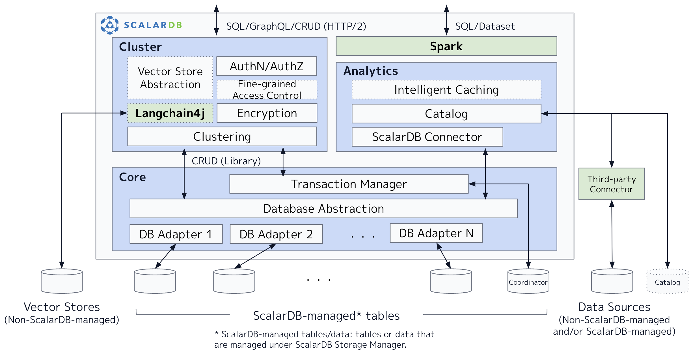

---
tags:
  - Community
  - Enterprise Standard
  - Enterprise Premium
displayed_sidebar: docsEnglish
---

# ScalarDB Design

This document briefly explains the design and implementation of ScalarDB. For what ScalarDB is and its use cases, see [ScalarDB Overview](./overview.mdx).

## Overall architecture

ScalarDB is hybrid transaction/analytical processing (HTAP) middleware that sits in between applications and databases. As shown in the following figure, ScalarDB consists of three components: Core, Cluster, and Analytics. ScalarDB basically employs a layered architecture, so the Cluster and Analytics components use the Core component to interact with underlying databases but sometimes bypass the Core component for performance optimization without sacrificing correctness. Likewise, each component also consists of several layers. 

## Components

The following subsections explain each component one by one.

### Core

ScalarDB Core, which is provided as open-source software under the Apache 2 License, is an integral part of ScalarDB. Core provides a database manager that has an abstraction layer that abstracts underlying databases and adapters (or shims) that implement the abstraction for each database. In addition, it provides a transaction manager on top of the database abstraction that achieves database-agnostic transaction management based on Scalar's novel distributed transaction protocol called [Consensus Commit](./consensus-commit.mdx). Core is provided as a library that offers a simple CRUD interface.

### Cluster

ScalarDB Cluster, which is licensed under a commercial license, is a component that provides a clustering solution for the Core component to work as a clustered server. Cluster is mainly designed for OLTP workloads, which have many small, transactional and non-transactional reads and writes. In addition, it provides several enterprise features such as authentication, authorization, encryption at rest, and fine-grained access control (still under development). Not only does Cluster offer the same CRUD interface as the Core component, but it also offers SQL and GraphQL interfaces. Since Cluster is provided as a container in a Kubernetes Pod, you can increase performance and availability by having more containers.

### Analytics

ScalarDB Analytics, which is licensed under a commercial license, is a component that provides scalable analytical processing for the data managed by the Core component or managed by applications that don’t use ScalarDB. Analytics is mainly designed for OLAP workloads, which have a small number of large, analytical read queries. In addition, it offers a SQL and DataSet API through Spark. Since the Analytics component is provided as a Java package that can be installed on Apache Spark engines, you can increase performance by having more Spark worker nodes.

## Metadata tables

ScalarDB manages various types of metadata in the underlying databases to provide its capabilities. The following table summarizes the metadata managed by each component.

| Component | Metadata tables                                                                                        | Purpose                                                                               | Location                                                                    |
| --------- | ------------------------------------------------------------------------------------------------------ | ------------------------------------------------------------------------------------- | --------------------------------------------------------------------------- |
| Core      | `scalardb.metadata`                                                                                    | For database schema information                                                       | In all the databases under ScalarDB                                         |
| Core      | `coordinator.state`                                                                                    | For transaction statuses                                                              | In one designated database specified to store the Coordinator table         |
| Core      | Application-managed tables                                                                             | For WAL information                                                                   | In all the tables accessed by Consensus Commit                              |
| Cluster   | `scalardb.users`, `scalardb.namespace_privileges`, `scalardb.table_privileges`, `scalardb.auth_tokens` | For [authentication and authorization](./scalardb-cluster/scalardb-auth-with-sql.mdx) | In one designated database specified to store the scalardb system namespace |
| Cluster   | `scalardb.encrypted_columns`                                                                           | For [encryption at rest](./scalardb-cluster/encrypt-data-at-rest.mdx)                 | In one designated database specified to store the scalardb system namespace |
| Analytics | All the tables managed by the catalog server                                                           | For [data catalog](./scalardb-analytics/design.mdx#universal-data-catalog)            | In the catalog server database                                              |

:::note

If you need to take backups of the databases accessed by ScalarDB, you will also need to take backups of the metadata managed by ScalarDB. For more details, see [How to Back Up and Restore Databases Used Through ScalarDB](./backup-restore.mdx).

:::

## Limitations

ScalarDB operates between applications and databases, which leads to certain limitations. This section summarizes the limitations of ScalarDB.

### Applications cannot bypass ScalarDB to run transactions and analytical queries

ScalarDB Core offers a database-agnostic transaction capability that operates outside of databases. Therefore, applications must interact with ScalarDB to execute transactions; otherwise, ScalarDB cannot ensure transaction correctness, such as snapshot and serializable isolation. For more details, see [Consensus Commit](./consensus-commit.mdx).

Likewise, ScalarDB Analytics offers a scalable analytical query processing capability that operates outside of databases. Therefore, applications must interact with ScalarDB Analytics to execute analytical queries; otherwise, ScalarDB cannot ensure correctness, such as read-committed isolation. For more details, see [ScalarDB Analytics Design](./scalardb-analytics/design.mdx).

### Applications cannot use all the capabilities of the underlying databases

ScalarDB serves as an abstraction layer over the underlying databases, which means that applications cannot use all the capabilities and data types of these databases. For instance, ScalarDB does not support database-specific features such as Oracle PL/SQL.

ScalarDB has been enhanced to provide features that are commonly found in most supported databases. For a list of features, see [ScalarDB Features](./features.mdx). To learn about the features planned for future releases, see [Roadmap](./roadmap.mdx).

## Further reading

For more details about the design and implementation of ScalarDB, see the following documents:

- **Speaker Deck presentation:** [ScalarDB: Universal Transaction Manager](https://speakerdeck.com/scalar/scalar-db-universal-transaction-manager)

In addition, the following materials were presented at the VLDB 2023 conference:

- **Speaker Deck presentation:** [ScalarDB: Universal Transaction Manager for Polystores](https://speakerdeck.com/scalar/scalardb-universal-transaction-manager-for-polystores-vldb23)
- **Detailed paper:** [ScalarDB: Universal Transaction Manager for Polystores](https://www.vldb.org/pvldb/vol16/p3768-yamada.pdf)
