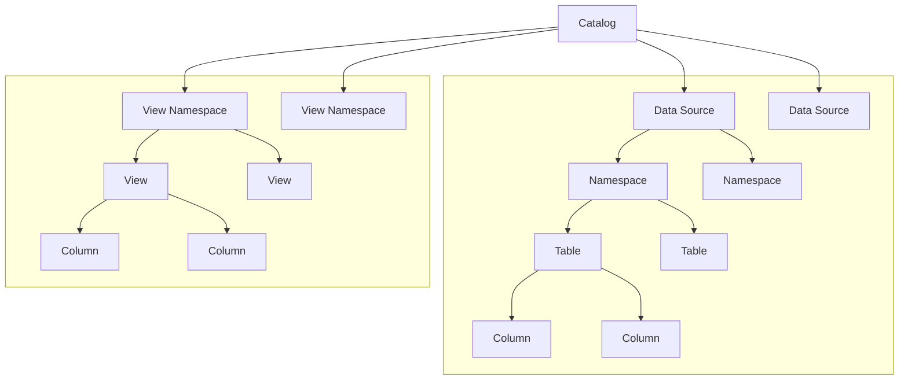

---
tags:
  - Enterprise Option
displayed_sidebar: docsEnglish
---

# ScalarDB Analytics Design

import Tabs from "@theme/Tabs";
import TabItem from "@theme/TabItem";

ScalarDB Analytics is the analytical component of ScalarDB. Similar to ScalarDB, it unifies diverse data sources—ranging from RDBMSs like PostgreSQL and MySQL to NoSQL databases like Cassandra and DynamoDB—into a single logical database. This enables you to perform analytical queries across multiple databases seamlessly.

ScalarDB Analytics consists of two main components: a universal data catalog and a query engine:

- **Universal data catalog.** The universal data catalog is a flexible metadata management system that handles multiple catalog spaces. Each catalog space provides an independent logical grouping of data sources and views, enabling organized management of diverse data environments.
- **Query engine.** The query engine executes queries against the universal data catalog. ScalarDB Analytics provides appropriate data connectors to interface with the underlying data sources.

ScalarDB Analytics employs a decoupled architecture where the data catalog and query engine are separate components. This design allows for integration with various existing query engines through an extensible architecture. As a result, you can select different query engines to execute queries against the same data catalog based on your specific requirements.

## Universal data catalog

The universal data catalog is composed of several levels and is structured as follows:



The following are definitions for those levels:

- **Catalog** is a folder that contains all your data source information. For example, you might have one catalog called `analytics_catalog` for your analytics data and another called `operational_catalog` for your day-to-day operations.
- **Data source** represents each data source you connect to. For each data source, we store important information like:
  - What kind of data source it is (PostgreSQL, Cassandra, etc.)
  - How to connect to it (connection details and passwords)
  - Special features the data source supports (like transactions)
- **Namespace** is like a subfolder within your data source that groups related tables together. In PostgreSQL these are called schemas, in Cassandra they're called keyspaces. You can have multiple levels of namespaces, similar to having folders within folders.
- **Table** is where your actual data lives. For each table, we keep track of:
  - What columns it has
  - What type of data each column can store
  - Whether columns can be empty (null)
- **View namespace** is a special folder for views. Unlike regular namespaces that are tied to one data source, view namespaces can work with multiple data sources at once.
- **View** is like a virtual table that can:
  - Show your data in a simpler way (like hiding technical columns in ScalarDB tables)
  - Combine data from different sources using SQL queries
  - Each view, like tables, has its own columns with specific types and rules about empty values.

### Supported data types

ScalarDB Analytics supports a wide range of data types across different data sources. The universal data catalog maps these data types to a common set of types to ensure compatibility and consistency across sources. The following list shows the supported data types in ScalarDB Analytics:

- `BYTE`
- `SMALLINT`
- `INT`
- `BIGINT`
- `FLOAT`
- `DOUBLE`
- `DECIMAL`
- `TEXT`
- `BLOB`
- `BOOLEAN`
- `DATE`
- `TIME`
- `TIMESTAMP`
- `TIMESTAMPTZ`
- `DURATION`
- `INTERVAL`

### Catalog information mappings by data source

When registering a data source to ScalarDB Analytics, the catalog information of the data source, that is, namespaces, tables, and columns, are resolved and registered to the universal data catalog. To resolve the catalog information of the data source, a particular object on the data sources side are mapped to the universal data catalog object. This mapping is consists of two parts: catalog-level mappings and data-type mappings. In the following sections, we describe how ScalarDB Analytics maps the catalog level and data type from each data source into the universal data catalog.

#### Catalog-level mappings

The catalog-level mappings are the mappings of the namespace names, table names, and column names from the data sources to the universal data catalog. To see the catalog-level mappings in each data source, select a data source.

<Tabs groupId="data-source" queryString>
  <TabItem value="scalardb" label="ScalarDB" default>
    The catalog information of ScalarDB is automatically resolved by ScalarDB Analytics. The catalog-level objects are mapped as follows:

    - The ScalarDB namespace is mapped to the namespace. Therefore, the namespace of the ScalarDB data source is always single level, consisting of only the namespace name.
    - The ScalarDB table is mapped to the table.
    - The ScalarDB column is mapped to the column.

  </TabItem>

  <TabItem value="postgresql" label="PostgreSQL" default>
    The catalog information of PostgreSQL is automatically resolved by ScalarDB Analytics. The catalog-level objects are mapped as follows:

    - The PostgreSQL schema is mapped to the namespace. Therefore, the namespace of the PostgreSQL data source is always single level, consisting of only the schema name.
        - Only user-defined schemas are mapped to namespaces. The following system schemas are ignored:
          - `information_schema`
          - `pg_catalog`
    - The PostgreSQL table is mapped to the table.
    - The PostgreSQL column is mapped to the column.

  </TabItem>
  <TabItem value="mysql" label="MySQL">
    The catalog information of MySQL is automatically resolved by ScalarDB Analytics. The catalog-level objects are mapped as follows:

    - The MySQL database is mapped to the namespace. Therefore, the namespace of the MySQL data source is always single level, consisting of only the database name.
        - Only user-defined databases are mapped to namespaces. The following system databases are ignored:
            - `mysql`
            - `sys`
            - `information_schema`
            - `performance_schema`
    - The MySQL table is mapped to the table.
    - The MySQL column is mapped to the column.

  </TabItem>
  <TabItem value="oracle" label="Oracle">
    The catalog information of Oracle is automatically resolved by ScalarDB Analytics. The catalog-level objects are mapped as follows:

    - The Oracle schema is mapped to the namespace. Therefore, the namespace of the Oracle data source is always single level, consisting of only schema name.
        - Only user-defined schemas are mapped to namespaces. The following system schemas are ignored:
            - `ANONYMOUS`
            - `APPQOSSYS`
            - `AUDSYS`
            - `CTXSYS`
            - `DBSNMP`
            - `DGPDB_INT`
            - `DBSFWUSER`
            - `DVF`
            - `DVSYS`
            - `GGSYS`
            - `GSMADMIN_INTERNAL`
            - `GSMCATUSER`
            - `GSMROOTUSER`
            - `GSMUSER`
            - `LBACSYS`
            - `MDSYS`
            - `OJVMSYS`
            - `ORDDATA`
            - `ORDPLUGINS`
            - `ORDSYS`
            - `OUTLN`
            - `REMOTE_SCHEDULER_AGENT`
            - `SI_INFORMTN_SCHEMA`
            - `SYS`
            - `SYS$UMF`
            - `SYSBACKUP`
            - `SYSDG`
            - `SYSKM`
            - `SYSRAC`
            - `SYSTEM`
            - `WMSYS`
            - `XDB`
            - `DIP`
            - `MDDATA`
            - `ORACLE_OCM`
            - `XS$NULL`

  </TabItem>
  <TabItem value="sql-server" label="SQL Server">
    The catalog information of SQL Server is automatically resolved by ScalarDB Analytics. The catalog-level objects are mapped as follows:

    - The SQL Server database and schema are mapped to the namespace together. Therefore, the namespace of the SQL Server data source is always two-level, consisting of the database name and the schema name.
        - Only user-defined databases are mapped to namespaces. The following system databases are ignored:
            - `sys`
            - `guest`
            - `INFORMATION_SCHEMA`
            - `db_accessadmin`
            - `db_backupoperator`
            - `db_datareader`
            - `db_datawriter`
            - `db_ddladmin`
            - `db_denydatareader`
            - `db_denydatawriter`
            - `db_owner`
            - `db_securityadmin`
        - Only user-defined schemas are mapped to namespaces. The following system schemas are ignored:
            - `master`
            - `model`
            - `msdb`
            - `tempdb`
    - The SQL Server table is mapped to the table.
    - The SQL Server column is mapped to the column.

  </TabItem>
  <TabItem value="dynamodb" label="DynamoDB">
    Since DynamoDB is schema-less, you need to specify the catalog information explicitly when registering a DynamoDB data source by using the following format JSON:

    ```json
    {
        "namespaces": [
            {
                "name": "<NAMESPACE_NAME>",
                "tables": [
                    {
                        "name": "<TABLE_NAME>",
                        "columns": [
                            {
                                "name": "<COLUMN_NAME>",
                                "type": "<COLUMN_TYPE>"
                            },
                            ...
                        ]
                    },
                    ...
                ]
            },
            ...
        ]
    }
    ```

    In the specified JSON, you can use any arbitrary namespace names, but the table names must match the table names in DynamoDB and column name and type must match field names and types in DynamoDB.

  </TabItem>
</Tabs>

#### Data-type mappings

The native data types of the underlying data sources are mapped to the data types in ScalarDB Analytics. To see the data-type mappings in each data source, select a data source.

<Tabs groupId="data-source" queryString>
  <TabItem value="scalardb" label="ScalarDB" default>
    | **ScalarDB Data Type**      | **ScalarDB Analytics Data Type** |
    |:------------------------------|:---------------------------------|
    | `BOOLEAN`                     | `BOOLEAN`                        |
    | `INT`                         | `INT`                            |
    | `BIGINT`                      | `BIGINT`                         |
    | `FLOAT`                       | `FLOAT`                          |
    | `DOUBLE`                      | `DOUBLE`                         |
    | `TEXT`                        | `TEXT`                           |
    | `BLOB`                        | `BLOB`                           |
    | `DATE`                        | `DATE`                           |
    | `TIME`                        | `TIME`                           |
    | `TIMESTAMP`                   | `TIMESTAMP`                      |
    | `TIMESTAMPTZ`                 | `TIMESTAMPTZ`                    |
  </TabItem>
  <TabItem value="postgresql" label="PostgreSQL" default>
    | **PostgreSQL Data Type**      | **ScalarDB Analytics Data Type** |
    |:------------------------------|:---------------------------------|
    | `integer`                     | `INT`                            |
    | `bigint`                      | `BIGINT`                         |
    | `real`                        | `FLOAT`                          |
    | `double precision`            | `DOUBLE`                         |
    | `smallserial`                 | `SMALLINT`                       |
    | `serial`                      | `INT`                            |
    | `bigserial`                   | `BIGINT`                         |
    | `char`                        | `TEXT`                           |
    | `varchar`                     | `TEXT`                           |
    | `text`                        | `TEXT`                           |
    | `bpchar`                      | `TEXT`                           |
    | `boolean`                     | `BOOLEAN`                        |
    | `bytea`                       | `BLOB`                           |
    | `date`                        | `DATE`                           |
    | `time`                        | `TIME`                           |
    | `time with time zone`         | `TIME`                           |
    | `time without time zone`      | `TIME`                           |
    | `timestamp`                   | `TIMESTAMP`                      |
    | `timestamp with time zone`    | `TIMESTAMPTZ`                      |
    | `timestamp without time zone` | `TIMESTAMP`                      |
  </TabItem>
  <TabItem value="mysql" label="MySQL">
    | **MySQL Data Type**    | **ScalarDB Analytics Data Type** |
    |:-----------------------|:---------------------------------|
    | `bit`                  | `BOOLEAN`                        |
    | `bit(1)`               | `BOOLEAN`                        |
    | `bit(x)` if *x >= 2*   | `BLOB`                           |
    | `tinyint`              | `SMALLINT`                       |
    | `tinyint(1)`           | `BOOLEAN`                        |
    | `boolean`              | `BOOLEAN`                        |
    | `smallint`             | `SMALLINT`                       |
    | `smallint unsigned`    | `INT`                            |
    | `mediumint`            | `INT`                            |
    | `mediumint unsigned`   | `INT`                            |
    | `int`                  | `INT`                            |
    | `int unsigned`         | `BIGINT`                         |
    | `bigint`               | `BIGINT`                         |
    | `float`                | `FLOAT`                          |
    | `double`               | `DOUBLE`                         |
    | `real`                 | `DOUBLE`                         |
    | `char`                 | `TEXT`                           |
    | `varchar`              | `TEXT`                           |
    | `text`                 | `TEXT`                           |
    | `binary`               | `BLOB`                           |
    | `varbinary`            | `BLOB`                           |
    | `blob`                 | `BLOB`                           |
    | `date`                 | `DATE`                           |
    | `time`                 | `TIME`                           |
    | `datetime`             | `TIMESTAMP`                      |
    | `timestamp`            | `TIMESTAMPTZ`                      |
  </TabItem>
  <TabItem value="oracle" label="Oracle">
    | **Oracle Data Type**               | **ScalarDB Analytics Data Type** |
    |:-----------------------------------|:---------------------------------|
    | `NUMBER` if *scale = 0*            | `BIGINT`                         |
    | `NUMBER` if *scale > 0*            | `DOUBLE`                         |
    | `FLOAT` if *precision ≤ 53*        | `DOUBLE`                         |
    | `BINARY_FLOAT`                     | `FLOAT`                          |
    | `BINARY_DOUBLE`                    | `DOUBLE`                         |
    | `CHAR`                             | `TEXT`                           |
    | `NCHAR`                            | `TEXT`                           |
    | `VARCHAR2`                         | `TEXT`                           |
    | `NVARCHAR2`                        | `TEXT`                           |
    | `CLOB`                             | `TEXT`                           |
    | `NCLOB`                            | `TEXT`                           |
    | `BLOB`                             | `BLOB`                           |
    | `BOOLEAN`                          | `BOOLEAN`                        |
    | `DATE`                             | `DATE`                           |
    | `TIMESTAMP`                        | `TIMESTAMPTZ`                      |
    | `TIMESTAMP WITH TIME ZONE`         | `TIMESTAMPTZ`                      |
    | `TIMESTAMP WITH LOCAL TIME ZONE`   | `TIMESTAMP`                      |
    | `RAW`                              | `BLOB`                           |
  </TabItem>
  <TabItem value="sql-server" label="SQL Server">
    | **SQL Server Data Type**   | **ScalarDB Analytics Data Type** |
    |:---------------------------|:---------------------------------|
    | `bit`                      | `BOOLEAN`                        |
    | `tinyint`                  | `SMALLINT`                       |
    | `smallint`                 | `SMALLINT`                       |
    | `int`                      | `INT`                            |
    | `bigint`                   | `BIGINT`                         |
    | `real`                     | `FLOAT`                          |
    | `float`                    | `DOUBLE`                         |
    | `float(n)` if *n ≤ 24*     | `FLOAT`                          |
    | `float(n)` if *n ≥ 25*     | `DOUBLE`                         |
    | `binary`                   | `BLOB`                           |
    | `varbinary`                | `BLOB`                           |
    | `char`                     | `TEXT`                           |
    | `varchar`                  | `TEXT`                           |
    | `nchar`                    | `TEXT`                           |
    | `nvarchar`                 | `TEXT`                           |
    | `ntext`                    | `TEXT`                           |
    | `text`                     | `TEXT`                           |
    | `date`                     | `DATE`                           |
    | `time`                     | `TIME`                           |
    | `datetime`                 | `TIMESTAMP`                      |
    | `datetime2`                | `TIMESTAMP`                      |
    | `smalldatetime`            | `TIMESTAMP`                      |
    | `datetimeoffset`           | `TIMESTAMPTZ`                      |
  </TabItem>
  <TabItem value="dynamodb" label="DynamoDB">
    | **DynamoDB Data Type**   | **ScalarDB Analytics Data Type** |
    |:-------------------------|:---------------------------------|
    | `Number`                 | `BYTE`                           |
    | `Number`                 | `SMALLINT`                       |
    | `Number`                 | `INT`                            |
    | `Number`                 | `BIGINT`                         |
    | `Number`                 | `FLOAT`                          |
    | `Number`                 | `DOUBLE`                         |
    | `Number`                 | `DECIMAL`                        |
    | `String`                 | `TEXT`                           |
    | `Binary`                 | `BLOB`                           |
    | `Boolean`                | `BOOLEAN`                        |

:::warning

It is important to ensure that the field values of `Number` types are parsable as a specified data type for ScalarDB Analytics. For example, if a column that corresponds to a `Number`-type field is specified as an `INT` type, its value must be an integer. If the value is not an integer, an error will occur when running a query.

:::

  </TabItem>
</Tabs>

## Query engine

A query engine is an independent component along with the universal data catalog, which is responsible for executing queries against the data sources registered in the universal data catalog and returning the results to the user. ScalarDB Analytics does not currently provide a built-in query engine. Instead, it is designed to be integrated with existing query engines, normally provided as a plugin of the query engine.

When you run a query, the ScalarDB Analytics query engine plugin works as follows:

1. Fetches the catalog metadata by calling the universal data catalog API, like the data source location, the table object identifier, and the table schema.
2. Sets up the data source connectors to the data sources by using the catalog metadata.
3. Provides the query optimization information to the query engine based on the catalog metadata.
4. Reads the data from the data sources by using the data source connectors.

ScalarDB Analytics manages these processes internally. You can simply run a query against the universal data catalog by using the query engine API in the same way that you would normally run a query.

ScalarDB Analytics currently supports Apache Spark as its query engine. For details on how to use ScalarDB Analytics with Spark, see [Run Analytical Queries Through ScalarDB Analytics](./run-analytical-queries.mdx).
