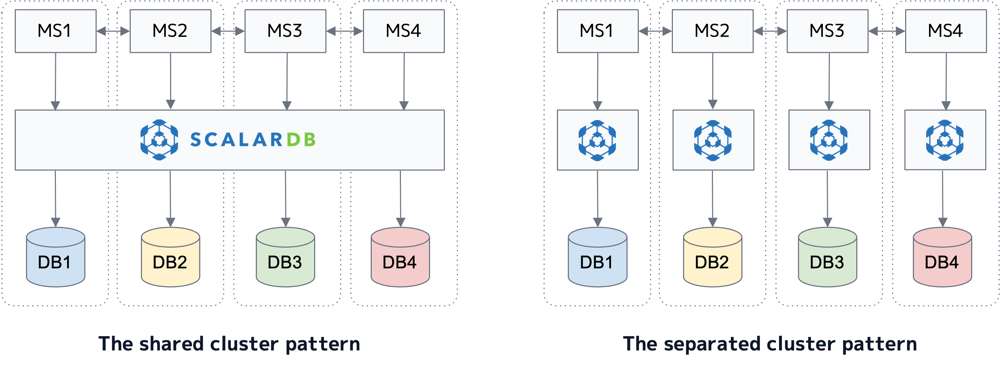

---
tags:
  - Enterprise Standard
  - Enterprise Premium
displayed_sidebar: docsEnglish
---

# ScalarDB Cluster Deployment Patterns for Microservices

When building microservice applications that use ScalarDB Cluster, there are two patterns you can choose for how to deploy ScalarDB Cluster: shared-cluster pattern and separated-cluster pattern.
This document first explains those patterns, how they differ, and the basic guidelines on which one to choose in which cases.

Also, this document assumes that your microservice applications are created based on the database-per-service pattern, where each microservice manages its database, and a microservice needs to access another microservice's database via APIs between the microservices.

## ScalarDB Cluster deployment patterns

In the shared-cluster pattern, microservices share one ScalarDB Cluster instance, which is a cluster of ScalarDB Cluster nodes, in a system, so they access the same ScalarDB Cluster instance to interact with their databases. On the other hand, in the separated-cluster pattern, microservices use several ScalarDB Cluster instances. Typically, one microservice accesses one ScalarDB Cluster instance to interact with its database.

The following diagram shows the patterns. (MS stands for microservice.)

:::note

You also need to manage the Coordinator table in either pattern in addition to the databases required for microservices.

:::

## Pros and cons

One obvious difference is the amount of resources for ScalarDB Cluster instances. With the separated-cluster pattern, you need more resources to manage your applications. This also incurs more maintenance burden and costs.

In addition, the ScalarDB Cluster APIs that you would need to use are different. Specifically, for the shared-cluster pattern, you need to use the [one-phase commit interface](../api-guide.mdx#transactional-api), where only one microservice needs to call `commit` to commit a transaction after microservices read and write records. For the separated-cluster pattern, you need to use the [two-phase commit interface](../two-phase-commit-transactions.mdx), where all the microservices first need to call `prepare` and then call `commit` if all the prepare calls are successful. Therefore, microservices with the separated-cluster pattern will likely be more complex than microservices with the shared-cluster pattern because they need to handle transactions and their errors in a more fine-grained manner.

Moreover, the level of resource isolation is different. Microservices should be well-isolated for better maintainability and development efficiency, but the shared-cluster pattern brings weaker resource isolation. Weak resource isolation might also bring weak security. However, security risks can be mitigated by using the security features of ScalarDB Cluster, like authentication and authorization.

Similarly, there is a difference in how systems are administrated. Specifically, in the shared-cluster pattern, a team must be tasked with managing a ScalarDB Cluster instance on behalf of the other teams. Typically, the central data team can manage it, but issues may arise if no such team exists. With the separated-cluster pattern, administration is more balanced but has a similar issue for the Coordinator table. The issue can be addressed by having a microservice for coordination and making a team manage the microservice.

The following is a summary of the pros and cons of the patterns.

### Shared-cluster pattern

- **Pros:**
  - Simple transaction and error handling because of the one-phase commit interface. (Backup operations for databases can also be simple.)
  - Less resource usage because it uses one ScalarDB Cluster instance. 
- **Cons:**
  - Weak resource isolation between microservices.
  - Unbalanced administration. (One team needs to manage a ScalarDB Cluster instance on behalf of the others.)

### Separated-cluster pattern

- **Pros:**
  - Better resource isolation.
  - More balanced administration. (A team manages one microservice and one ScalarDB Cluster instance. Also, a team must be tasked with managing the Coordinator table.)
- **Cons:**
  - Complex transaction and error handling due to the two-phase commit interface. (Backup operations for databases can also be complex.)
  - More resource usage because of several ScalarDB Cluster instances.

## Which pattern to choose

Using the shared-cluster pattern is recommended whenever possible. Although the shared-cluster pattern has some disadvantages, as described above, its simplicity and ease of management outweigh those disadvantages. Moreover, since ScalarDB Cluster stores all critical states in their underlying databases and does not hold any critical states in its memory, it can be seen as just a path to the databases. Therefore, we believe a system with the shared-cluster pattern still complies with the database-per-service pattern and does not violate the microservice philosophy much.

If the cons of the shared-cluster pattern are not acceptable, you can still use the separated-cluster pattern. However, you should use that pattern only if you properly understand the mechanism and usage of the two-phase commit interface. Otherwise, you might face some issues, like database anomalies.

## Limitations

ScalarDB provides several APIs, such as CRUD, SQL, and Spring Data JDBC. Although the CRUD and SQL interfaces support both the shared-cluster and separated-cluster patterns, the Spring Data JDBC interface does not support the shared-cluster pattern. This is because its one-phase commit interface currently assumes an application is monolithic, where it is not divided into microservices that interact with each other. The Spring Data JDBC interface supports the two-phase commit interface and the separated-cluster pattern, just as the other APIs do.

## See also

- [Transactions with a Two-Phase Commit Interface](../two-phase-commit-transactions.mdx)

