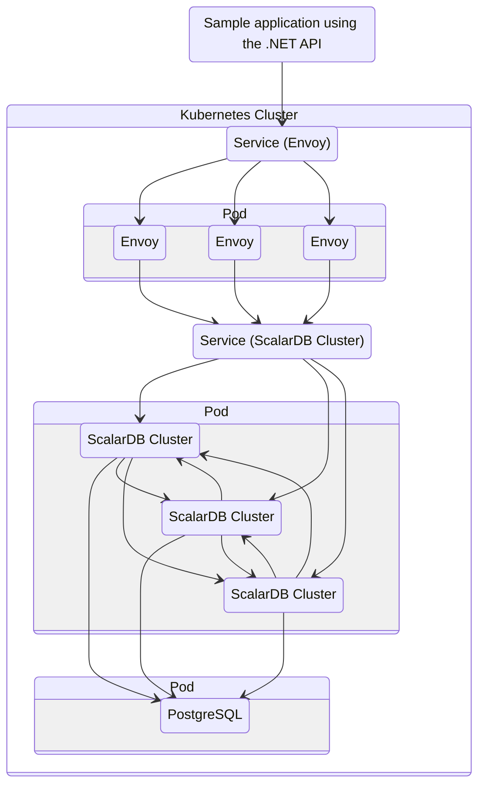
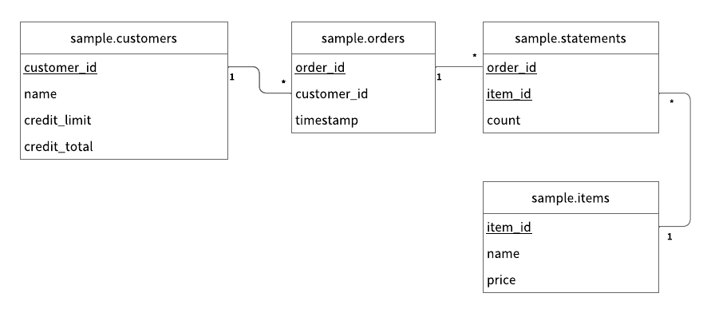

---
tags:
  - Enterprise Premium
displayed_sidebar: docsEnglish
---

# Getting Started with ScalarDB Cluster SQL via .NET and LINQ

This tutorial describes how to create a sample application that uses [ScalarDB Cluster](./index.mdx) SQL through LINQ.

## Overview

This tutorial illustrates the process of creating a sample e-commerce application, where items can be ordered and paid for with a line of credit by using ScalarDB.

:::note

Since the focus of the sample application is to demonstrate using ScalarDB, application-specific error handling, authentication processing, and similar functions are not included in the sample application. For details about exception handling, see [Exception Handling in the ScalarDB Cluster .NET Client SDK](../scalardb-cluster-dotnet-client-sdk/exception-handling.mdx).

:::

The following diagram shows the system architecture of the sample application:



### What you can do in this sample application

The sample application supports the following types of transactions:

- Get customer information.
- Place an order by using a line of credit.
  - Checks if the cost of the order is below the customer's credit limit.
  - If the check passes, records the order history and updates the amount the customer has spent.
- Get order information by order ID.
- Get order information by customer ID.
- Make a payment.
  - Reduces the amount the customer has spent.

## Prerequisites for this sample application

- [.NET SDK 8.0](https://dotnet.microsoft.com/en-us/download/dotnet/8.0)
- ScalarDB Cluster running on a Kubernetes cluster
  - We assume that you have a ScalarDB Cluster running on a Kubernetes cluster that you deployed by following the instructions in [How to Deploy ScalarDB Cluster Locally](setup-scalardb-cluster-on-kubernetes-by-using-helm-chart.mdx).

:::note

.NET SDK 8.0 is the version used to create the sample application. For information about all supported versions, see [Requirements](../requirements.mdx#net)

:::

## Set up ScalarDB Cluster

The following sections describe how to set up the sample e-commerce application.

### Clone the ScalarDB samples repository

Open **Terminal**, then clone the ScalarDB samples repository by running the following command:

```console
git clone https://github.com/scalar-labs/scalardb-samples
```

Then, go to the directory that contains the sample application by running the following command:

```console
cd scalardb-samples/scalardb-dotnet-samples/scalardb-cluster-linq-sample
```

### Update the referenced version of the ScalarDB.Client package

To use ScalarDB Cluster, open `ScalarDbClusterSample.csproj` in your preferred text editor. Then, update the version of the referenced `ScalarDB.Client` package, replacing `<MAJOR>.<MINOR>` with the version of the deployed ScalarDB Cluster:

```xml
<PackageReference Include="ScalarDB.Client" Version="<MAJOR>.<MINOR>.*" />
```

### Modify `scalardb-options.json`

You need to modify `scalardb-options.json` to connect to ScalarDB Cluster as well. But before doing so, you need to get the `EXTERNAL-IP` address of the Envoy service resource (`scalardb-cluster-envoy`). To get the service resource, run the following command:

```console
kubectl get svc scalardb-cluster-envoy
```

You should see a similar output as below, with different values for `CLUSTER-IP`, `PORT(S)`, and `AGE`:

```console
NAME                     TYPE           CLUSTER-IP      EXTERNAL-IP   PORT(S)           AGE
scalardb-cluster-envoy   LoadBalancer   10.105.121.51   localhost     60053:30641/TCP   16h
```

In this case, the `EXTERNAL-IP` address is `localhost`.

Open `scalardb-options.json` by running the following command:

```console
vim scalardb-options.json
```

Then, modify `scalardb-options.json` as follows:

```json
{
    "ScalarDbOptions": {
        "Address": "http://localhost:60053"
    }
}
```

### Load the initial data

Before running the sample application, you need to load the initial data by running the following command:

```console
dotnet run LoadInitialData
```

#### Schema details

Running the command above will also apply the schema. All the tables are created in the `sample` namespace.

- `sample.customers`: a table that manages customer information
  - `credit_limit`: the maximum amount of money that the lender will allow the customer to spend from their line of credit
  - `credit_total`: the amount of money that the customer has spent from their line of credit
- `sample.orders`: a table that manages order information
- `sample.statements`: a table that manages order statement information
- `sample.items`: a table that manages information for items to be ordered

The Entity Relationship Diagram for the schema is as follows:



#### Initial data

After the initial data has loaded, the following records should be stored in the tables.

**`sample.customers` table**

| customer_id | name          | credit_limit | credit_total |
|-------------|---------------|--------------|--------------|
| 1           | Yamada Taro   | 10000        | 0            |
| 2           | Yamada Hanako | 10000        | 0            |
| 3           | Suzuki Ichiro | 10000        | 0            |

**`sample.items` table**

| item_id | name   | price |
|---------|--------|-------|
| 1       | Apple  | 1000  |
| 2       | Orange | 2000  |
| 3       | Grape  | 2500  |
| 4       | Mango  | 5000  |
| 5       | Melon  | 3000  |

## Execute transactions and retrieve data in the sample application

The following sections describe how to execute transactions and retrieve data in the sample e-commerce application.

### Get customer information

Start with getting information about the customer whose ID is `1` by running the following command:

```console
dotnet run GetCustomerInfo 1
```

You should see the following output:

```console
{
  "id": 1,
  "name": "Yamada Taro",
  "credit_limit": 10000,
  "credit_total": 0
}
```

### Place an order

Then, have customer ID `1` place an order for three apples and two oranges by running the following command:

:::note

The order format in this command is `dotnet run PlaceOrder <CUSTOMER_ID> <ITEM_ID>:<COUNT>,<ITEM_ID>:<COUNT>,..."`.

:::

```console
dotnet run PlaceOrder 1 1:3,2:2
```

You should see a similar output as below, with a different UUID for `order_id`, which confirms that the order was successful:

```console
{
  "order_id": "5a22150b-1944-403f-b02c-77183e705d1b"
}
```

### Check order details

Check details about the order by running the following command, replacing `<ORDER_ID_UUID>` with the UUID for the `order_id` that was shown after running the previous command:

```console
dotnet run GetOrder <ORDER_ID_UUID>
```

You should see a similar output as below, with different UUIDs for `order_id` and `timestamp`:

```console
{
  "order": {
    "order_id": "5a22150b-1944-403f-b02c-77183e705d1b",
    "timestamp": 1743143358216,
    "customer_id": 1,
    "customer_name": "Yamada Taro",
    "statements": [
      {
        "item_id": 1,
        "item_name": "Apple",
        "price": 1000,
        "count": 3,
        "total": 3000
      },
      {
        "item_id": 2,
        "item_name": "Orange",
        "price": 2000,
        "count": 2,
        "total": 4000
      }
    ],
    "total": 7000
  }
}
```

### Place another order

Place an order for one melon that uses the remaining amount in `credit_total` for customer ID `1` by running the following command:

```console
dotnet run PlaceOrder 1 5:1
```

You should see a similar output as below, with a different UUID for `order_id`, which confirms that the order was successful:

```console
{
  "order_id": "79fcd778-94ba-4e8b-b993-cdb88a6186a8"
}
```

### Check order history

Get the history of all orders for customer ID `1` by running the following command:

```console
dotnet run GetOrders 1
```

You should see a similar output as below, with different UUIDs for `order_id` and `timestamp`, which shows the history of all orders for customer ID `1`:

```console
{
  "orders": [
    {
      "order_id": "5a22150b-1944-403f-b02c-77183e705d1b",
      "timestamp": 1743143358216,
      "customer_id": 1,
      "customer_name": "Yamada Taro",
      "statements": [
        {
          "item_id": 1,
          "item_name": "Apple",
          "price": 1000,
          "count": 3,
          "total": 3000
        },
        {
          "item_id": 2,
          "item_name": "Orange",
          "price": 2000,
          "count": 2,
          "total": 4000
        }
      ],
      "total": 7000
    },
    {
      "order_id": "79fcd778-94ba-4e8b-b993-cdb88a6186a8",
      "timestamp": 1743143505436,
      "customer_id": 1,
      "customer_name": "Yamada Taro",
      "statements": [
        {
          "item_id": 5,
          "item_name": "Melon",
          "price": 3000,
          "count": 1,
          "total": 3000
        }
      ],
      "total": 3000
    }
  ]
}
```

### Check credit total

Get the credit total for customer ID `1` by running the following command:

```console
dotnet run GetCustomerInfo 1
```

You should see the following output, which shows that customer ID `1` has reached their `credit_limit` in `credit_total` and cannot place anymore orders:

```console
{
  "id": 1,
  "name": "Yamada Taro",
  "credit_limit": 10000,
  "credit_total": 10000
}
```

Try to place an order for one grape and one mango by running the following command:

```console
dotnet run PlaceOrder 1 3:1,4:1
```

You should see a similar output as below, which shows that the order failed because the `credit_total` amount would exceed the `credit_limit` amount.

```console
Unhandled exception: System.Exception: Credit limit exceeded (17500 > 10000)
   at ScalarDbClusterLinqSample.Sample.PlaceOrder(Int32 customerId, IReadOnlyDictionary`2 itemCounts) in /scalar-labs/scalardb-samples/scalardb-dotnet-samples/scalardb-cluster-linq-sample/Sample.cs:line 145
   at ScalarDbClusterLinqSample.Commands.PlaceOrderCommand.<>c.<<Create>b__6_0>d.MoveNext() in /scalar-labs/scalardb-samples/scalardb-dotnet-samples/scalardb-cluster-linq-sample/Commands/PlaceOrderCommand.cs:line 47
--- End of stack trace from previous location ---
...
```

### Make a payment

To continue making orders, customer ID `1` must make a payment to reduce the `credit_total` amount.

Make a payment by running the following command:

```console
dotnet run Repayment 1 8000
```

Then, check the `credit_total` amount for customer ID `1` by running the following command:

```console
dotnet run GetCustomerInfo 1
```

You should see the following output, which shows that a payment was applied to customer ID `1`, reducing the `credit_total` amount:

```console
{
  "id": 1,
  "name": "Yamada Taro",
  "credit_limit": 10000,
  "credit_total": 2000
}
```

Now that customer ID `1` has made a payment, place an order for one grape and one melon by running the following command:

```console
dotnet run PlaceOrder 1 3:1,4:1
```

You should see a similar output as below, with a different UUID for `order_id`, which confirms that the order was successful:

```console
{
  "order_id": "ecd68f46-e248-4f2e-b581-620e9019bf5b"
}
```

## See also

For details about developing applications that use ScalarDB Cluster with the .NET API, refer to the following:

- [ScalarDB Cluster .NET Client SDK Overview](../scalardb-cluster-dotnet-client-sdk/index.mdx)
- [Getting Started with LINQ in the ScalarDB Cluster .NET Client SDK](../scalardb-cluster-dotnet-client-sdk/getting-started-with-linq.mdx)

For details about the ScalarDB Cluster gRPC API, refer to the following:

- [ScalarDB Cluster gRPC API Guide](scalardb-cluster-grpc-api-guide.mdx)
- [ScalarDB Cluster SQL gRPC API Guide](scalardb-cluster-sql-grpc-api-guide.mdx)
