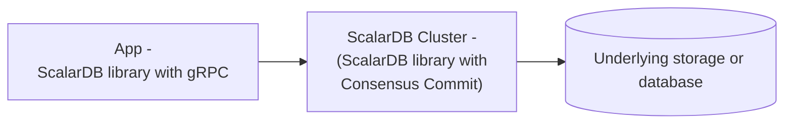

---
tags:
  - Enterprise Standard
  - Enterprise Premium
displayed_sidebar: docsEnglish
---

# ScalarDB Cluster Configurations

import Tabs from '@theme/Tabs';
import TabItem from '@theme/TabItem';

This document describes the configurations for ScalarDB Cluster. ScalarDB Cluster consists of multiple cluster nodes, each of which needs to be configured. The configurations need to be specified in the properties file.

## Cluster configurations

This section describes the configurations for ScalarDB Cluster.

### General configurations

The following general configurations are available for ScalarDB Cluster.

#### Transaction management configurations

The following transaction management-related configurations are available for ScalarDB Cluster.

##### `transaction_manager`

- **Field:** `scalar.db.transaction_manager`
- **Description:** Transaction manager of ScalarDB. Specify `consensus-commit` to use [Consensus Commit](../consensus-commit.mdx) or `single-crud-operation` to [run non-transactional storage operations](./run-non-transactional-storage-operations-through-scalardb-cluster.mdx). Note that the configurations under the `scalar.db.consensus_commit` prefix are ignored if you use `single-crud-operation`.
- **Default value:** `consensus-commit`

##### `isolation_level`

- **Field:** `scalar.db.consensus_commit.isolation_level`
- **Description:** Isolation level used for Consensus Commit. Either `SNAPSHOT`, `SERIALIZABLE`, or `READ_COMMITTED` can be specified.
- **Default value:** `SNAPSHOT`

##### `coordinator.namespace`

- **Field:** `scalar.db.consensus_commit.coordinator.namespace`
- **Description:** Namespace name of Coordinator tables used for Consensus Commit.
- **Default value:** `coordinator`

#### Node configurations

The following node-related configurations are available for ScalarDB Cluster.

##### `cluster.membership.type`

- **Field:** `scalar.db.cluster.membership.type`
- **Description:** Membership type. Currently, only `KUBERNETES` can be specified.
- **Default value:** `KUBERNETES`

##### `cluster.membership.kubernetes.endpoint.namespace_name`

- **Field:** `scalar.db.cluster.membership.kubernetes.endpoint.namespace_name`
- **Description:** This configuration is for the `KUBERNETES` membership type. Namespace name for the [endpoint resource](https://kubernetes.io/docs/concepts/services-networking/service/#endpoints).
- **Default value:** `default`

##### `cluster.membership.kubernetes.endpoint.name`

- **Field:** `scalar.db.cluster.membership.kubernetes.endpoint.name`
- **Description:** This configuration is for the `KUBERNETES` membership type. Name of the [endpoint resource](https://kubernetes.io/docs/concepts/services-networking/service/#endpoints) to get the membership info.
- **Default value:** empty

##### `cluster.node.decommissioning_duration_secs`

- **Field:** `scalar.db.cluster.node.decommissioning_duration_secs`
- **Description:** Duration in seconds until a ScalarDB Cluster node is actually decommissioned when shutting down.
- **Default value:** `30`

##### `cluster.node.grpc.max_inbound_message_size`

- **Field:** `scalar.db.cluster.node.grpc.max_inbound_message_size`
- **Description:** Maximum message size allowed to be received.
- **Default value:** The gRPC default value

##### `cluster.node.grpc.max_inbound_metadata_size`

- **Field:** `scalar.db.cluster.node.grpc.max_inbound_metadata_size`
- **Description:** Maximum size of metadata allowed to be received.
- **Default value:** The gRPC default value

##### `cluster.node.port`

- **Field:** `scalar.db.cluster.node.port`
- **Description:** Port number of the ScalarDB Cluster node.
- **Default value:** `60053`

##### `cluster.node.prometheus_exporter_port`

- **Field:** `scalar.db.cluster.node.prometheus_exporter_port`
- **Description:** Port number of the Prometheus exporter.
- **Default value:** `9080`

##### `cluster.grpc.deadline_duration_millis`

- **Field:** `scalar.db.cluster.grpc.deadline_duration_millis`
- **Description:** Deadline duration for gRPC in milliseconds.
- **Default value:** `60000` (60 seconds)

##### `cluster.node.standalone_mode.enabled`

- **Field:** `scalar.db.cluster.node.standalone_mode.enabled`
- **Description:** Whether standalone mode is enabled. Note that if standalone mode is enabled, the membership configurations (`scalar.db.cluster.membership.*`) will be ignored.
- **Default value:** `false`

##### `transaction.enabled`

- **Field:** `scalar.db.transaction.enabled`
- **Description:** Whether the transaction feature is enabled. For example, if you use only the embedding feature, you can set this property to `false`.
- **Default value:** `true`

##### `cluster.node.scanner_management.expiration_time_millis`

- **Field:** `scalar.db.cluster.node.scanner_management.expiration_time_millis`
- **Description:** ScalarDB Cluster nodes maintain in-progress scanners. This process expires scanners that have been idle for an extended period to prevent resource leaks. This configuration specifies the expiration time of this scanner management feature in milliseconds.
- **Default value:** `60000` (60 seconds)

### Performance-related configurations

The following performance-related configurations are available for the Consensus Commit transaction manager.

#### `parallel_executor_count`

- **Field:** `scalar.db.consensus_commit.parallel_executor_count`
- **Description:** Number of executors (threads) for parallel execution. This number refers to the total number of threads across transactions in a ScalarDB Cluster node or a ScalarDB Core process.
- **Default value:** `128`

#### `parallel_preparation.enabled`

- **Field:** `scalar.db.consensus_commit.parallel_preparation.enabled`
- **Description:** Whether or not the preparation phase is executed in parallel.
- **Default value:** `true`

#### `parallel_validation.enabled`

- **Field:** `scalar.db.consensus_commit.parallel_validation.enabled`
- **Description:** Whether or not the validation phase (in `EXTRA_READ`) is executed in parallel.
- **Default value:** The value of `scalar.db.consensus_commit.parallel_commit.enabled`

#### `parallel_commit.enabled`

- **Field:** `scalar.db.consensus_commit.parallel_commit.enabled`
- **Description:** Whether or not the commit phase is executed in parallel.
- **Default value:** `true`

#### `parallel_rollback.enabled`

- **Field:** `scalar.db.consensus_commit.parallel_rollback.enabled`
- **Description:** Whether or not the rollback phase is executed in parallel.
- **Default value:** The value of `scalar.db.consensus_commit.parallel_commit.enabled`

#### `async_commit.enabled`

- **Field:** `scalar.db.consensus_commit.async_commit.enabled`
- **Description:** Whether or not the commit phase is executed asynchronously.
- **Default value:** `false`

#### `async_rollback.enabled`

- **Field:** `scalar.db.consensus_commit.async_rollback.enabled`
- **Description:** Whether or not the rollback phase is executed asynchronously.
- **Default value:** The value of `scalar.db.consensus_commit.async_commit.enabled`

#### `parallel_implicit_pre_read.enabled`

- **Field:** `scalar.db.consensus_commit.parallel_implicit_pre_read.enabled`
- **Description:** Whether or not implicit pre-read is executed in parallel.
- **Default value:** `true`

#### `one_phase_commit.enabled`

- **Field:** `scalar.db.consensus_commit.one_phase_commit.enabled`
- **Description:** Whether or not the one-phase commit optimization is enabled.
- **Default value:** `false`

#### `coordinator.write_omission_on_read_only.enabled`

- **Field:** `scalar.db.consensus_commit.coordinator.write_omission_on_read_only.enabled`
- **Description:** Whether or not the Coordinator write omission optimization is enabled for read-only transactions. This optimization is useful for read-only transactions that do not modify any data, as it avoids unnecessary writes to the Coordinator tables.
- **Default value:** `true`

#### `coordinator.group_commit.enabled`

- **Field:** `scalar.db.consensus_commit.coordinator.group_commit.enabled`
- **Description:** Whether or not committing the transaction state is executed in batch mode. This feature can't be used with a two-phase commit interface.
- **Default value:** `false`

#### `coordinator.group_commit.slot_capacity`

- **Field:** `scalar.db.consensus_commit.coordinator.group_commit.slot_capacity`
- **Description:** Maximum number of slots in a group for the group commit feature. A large value improves the efficiency of group commit, but may also increase latency and the likelihood of transaction conflicts.[^1]
- **Default value:** `20`

#### `coordinator.group_commit.group_size_fix_timeout_millis`

- **Field:** `scalar.db.consensus_commit.coordinator.group_commit.group_size_fix_timeout_millis`
- **Description:** Timeout to fix the size of slots in a group. A large value improves the efficiency of group commit, but may also increase latency and the likelihood of transaction conflicts.[^1]
- **Default value:** `40`

#### `coordinator.group_commit.delayed_slot_move_timeout_millis`

- **Field:** `scalar.db.consensus_commit.coordinator.group_commit.delayed_slot_move_timeout_millis`
- **Description:** Timeout to move delayed slots from a group to another isolated group to prevent the original group from being affected by delayed transactions. A large value improves the efficiency of group commit, but may also increase the latency and the likelihood of transaction conflicts.[^1]
- **Default value:** `1200`

#### `coordinator.group_commit.old_group_abort_timeout_millis`

- **Field:** `scalar.db.consensus_commit.coordinator.group_commit.old_group_abort_timeout_millis`
- **Description:** Timeout to abort an old ongoing group. A small value reduces resource consumption through aggressive aborts, but may also increase the likelihood of unnecessary aborts for long-running transactions.
- **Default value:** `60000`

#### `coordinator.group_commit.timeout_check_interval_millis`

- **Field:** `scalar.db.consensus_commit.coordinator.group_commit.timeout_check_interval_millis`
- **Description:** Interval for checking the group commit–related timeouts.
- **Default value:** `20`

#### `coordinator.group_commit.metrics_monitor_log_enabled`

- **Field:** `scalar.db.consensus_commit.coordinator.group_commit.metrics_monitor_log_enabled`
- **Description:** Whether or not the metrics of the group commit are logged periodically.
- **Default value:** `false`

### Storage-related configurations

ScalarDB has a storage (database) abstraction layer that supports multiple storage implementations. You can specify the storage implementation by using the `scalar.db.storage` property.

:::note

For details about using multiple storages, see [Multi-storage configurations](#multi-storage-configurations).

:::

Select a database to see the configurations available for each storage.

<Tabs groupId="databases" queryString>
  <TabItem value="JDBC_databases" label="JDBC databases" default>
    The following configurations are available for JDBC databases.

    <h4>`storage`</h4>

    - **Field:** `scalar.db.storage`
    - **Description:** `jdbc` must be specified.

    <h4>`contact_points`</h4>

    - **Field:** `scalar.db.contact_points`
    - **Description:** JDBC connection URL.
    - **Default value:** empty

    <h4>`username`</h4>

    - **Field:** `scalar.db.username`
    - **Description:** Username to access the database.
    - **Default value:** empty

    <h4>`password`</h4>

    - **Field:** `scalar.db.password`
    - **Description:** Password to access the database.
    - **Default value:** empty

    <h4>`jdbc.connection_pool.min_idle`</h4>

    - **Field:** `scalar.db.jdbc.connection_pool.min_idle`
    - **Description:** Minimum number of idle connections in the connection pool.
    - **Default value:** `20`

    <h4>`jdbc.connection_pool.max_idle`</h4>

    - **Field:** `scalar.db.jdbc.connection_pool.max_idle`
    - **Description:** Maximum number of connections that can remain idle in the connection pool.
    - **Default value:** `50`

    <h4>`jdbc.connection_pool.max_total`</h4>

    - **Field:** `scalar.db.jdbc.connection_pool.max_total`
    - **Description:** Maximum total number of idle and borrowed connections that can be active at the same time for the connection pool. Use a negative value for no limit.
    - **Default value:** `200`

    <h4>`jdbc.prepared_statements_pool.enabled`</h4>

    - **Field:** `scalar.db.jdbc.prepared_statements_pool.enabled`
    - **Description:** Setting this property to `true` enables prepared-statement pooling.
    - **Default value:** `false`

    <h4>`jdbc.prepared_statements_pool.max_open`</h4>

    - **Field:** `scalar.db.jdbc.prepared_statements_pool.max_open`
    - **Description:** Maximum number of open statements that can be allocated from the statement pool at the same time. Use a negative value for no limit.
    - **Default value:** `-1`

    <h4>`jdbc.isolation_level`</h4>

    - **Field:** `scalar.db.jdbc.isolation_level`
    - **Description:** Isolation level for JDBC. `READ_COMMITTED`, `REPEATABLE_READ`, or `SERIALIZABLE` can be specified.
    - **Default value:** Underlying-database specific

    <h4>`jdbc.table_metadata.connection_pool.min_idle`</h4>

    - **Field:** `scalar.db.jdbc.table_metadata.connection_pool.min_idle`
    - **Description:** Minimum number of idle connections in the connection pool for the table metadata.
    - **Default value:** `5`

    <h4>`jdbc.table_metadata.connection_pool.max_idle`</h4>

    - **Field:** `scalar.db.jdbc.table_metadata.connection_pool.max_idle`
    - **Description:** Maximum number of connections that can remain idle in the connection pool for the table metadata.
    - **Default value:** `10`

    <h4>`jdbc.table_metadata.connection_pool.max_total`</h4>

    - **Field:** `scalar.db.jdbc.table_metadata.connection_pool.max_total`
    - **Description:** Maximum total number of idle and borrowed connections that can be active at the same time for the connection pool for the table metadata. Use a negative value for no limit.
    - **Default value:** `25`

    <h4>`jdbc.admin.connection_pool.min_idle`</h4>

    - **Field:** `scalar.db.jdbc.admin.connection_pool.min_idle`
    - **Description:** Minimum number of idle connections in the connection pool for admin.
    - **Default value:** `5`

    <h4>`jdbc.admin.connection_pool.max_idle`</h4>

    - **Field:** `scalar.db.jdbc.admin.connection_pool.max_idle`
    - **Description:** Maximum number of connections that can remain idle in the connection pool for admin.
    - **Default value:** `10`

    <h4>`jdbc.admin.connection_pool.max_total`</h4>

    - **Field:** `scalar.db.jdbc.admin.connection_pool.max_total`
    - **Description:** Maximum total number of idle and borrowed connections that can be active at the same time for the connection pool for admin. Use a negative value for no limit.
    - **Default value:** `25`

    <h4>`jdbc.db2.variable_key_column_size`</h4>

    - **Field:** `scalar.db.jdbc.db2.variable_key_column_size`
    - **Description:** Column size for TEXT and BLOB columns in IBM Db2 when they are used as a primary key or secondary key. Minimum 64 bytes.
    - **Default value:** `128`

    <h4>`jdbc.db2.time_column.default_date_component`</h4>

    - **Field:** `scalar.db.jdbc.db2.time_column.default_date_component`
    - **Description:** Value of the date component used for storing `TIME` data in IBM Db2. Since the IBM Db2 TIMESTAMP type is used to store ScalarDB `TIME` type data because it provides fractional-second precision, ScalarDB stores `TIME` data with the same date component value for ease of comparison and sorting.
    - **Default value:** `1970-01-01`
:::note

If you're using SQLite3 as a JDBC database, you must set `scalar.db.contact_points` as follows:

```properties
scalar.db.contact_points=jdbc:sqlite:<SQLITE_DB_FILE_PATH>?busy_timeout=10000
```

Unlike other JDBC databases, [SQLite3 doesn't fully support concurrent access](https://www.sqlite.org/lang_transaction.html).
To avoid frequent errors caused internally by [`SQLITE_BUSY`](https://www.sqlite.org/rescode.html#busy), we recommend setting a [`busy_timeout`](https://www.sqlite.org/c3ref/busy_timeout.html) parameter.

:::
</TabItem>
<TabItem value="DynamoDB" label="DynamoDB">
The following configurations are available for DynamoDB.

    <h4>`storage`</h4>

    - **Field:** `scalar.db.storage`
    - **Description:** `dynamo` must be specified.

    <h4>`contact_points`</h4>

    - **Field:** `scalar.db.contact_points`
    - **Description:** AWS region with which ScalarDB should communicate (for example, `us-east-1`).
    - **Default value:** empty

    <h4>`username`</h4>

    - **Field:** `scalar.db.username`
    - **Description:** AWS access key used to identify the user interacting with AWS.
    - **Default value:** empty

    <h4>`password`</h4>

    - **Field:** `scalar.db.password`
    - **Description:** AWS secret access key used to authenticate the user interacting with AWS.
    - **Default value:** empty

    <h4>`dynamo.endpoint_override`</h4>

    - **Field:** `scalar.db.dynamo.endpoint_override`
    - **Description:** Amazon DynamoDB endpoint with which ScalarDB should communicate. This is primarily used for testing with a local instance instead of an AWS service.
    - **Default value:** empty

    <h4>`dynamo.namespace.prefix`</h4>

    - **Field:** `scalar.db.dynamo.namespace.prefix`
    - **Description:** Prefix for the user namespaces and metadata namespace names. Since AWS requires having unique tables names in a single AWS region, this is useful if you want to use multiple ScalarDB environments (development, production, etc.) in a single AWS region.
    - **Default value:** empty
  </TabItem>
  <TabItem value="Cosmos_DB_for_NoSQL" label="Cosmos DB for NoSQL">
    The following configurations are available for Cosmos DB for NoSQL.

    <h4>`storage`</h4>

    - **Field:** `scalar.db.storage`
    - **Description:** `cosmos` must be specified.

    <h4>`contact_points`</h4>

    - **Field:** `scalar.db.contact_points`
    - **Description:** Azure Cosmos DB for NoSQL endpoint with which ScalarDB should communicate.
    - **Default value:** empty

    <h4>`password`</h4>

    - **Field:** `scalar.db.password`
    - **Description:** Either a master or read-only key used to perform authentication for accessing Azure Cosmos DB for NoSQL.
    - **Default value:** empty

    <h4>`cosmos.consistency_level`</h4>

    - **Field:** `scalar.db.cosmos.consistency_level`
    - **Description:** Consistency level used for Cosmos DB operations. `STRONG` or `BOUNDED_STALENESS` can be specified.
    - **Default value:** `STRONG`
  </TabItem>
  <TabItem value="Cassandra" label="Cassandra">
    The following configurations are available for Cassandra.

    <h4>`storage`</h4>

    - **Field:** `scalar.db.storage`
    - **Description:** `cassandra` must be specified.

    <h4>`contact_points`</h4>

    - **Field:** `scalar.db.contact_points`
    - **Description:** Comma-separated contact points.
    - **Default value:** empty

    <h4>`contact_port`</h4>

    - **Field:** `scalar.db.contact_port`
    - **Description:** Port number for all the contact points.
    - **Default value:** empty

    <h4>`username`</h4>

    - **Field:** `scalar.db.username`
    - **Description:** Username to access the database.
    - **Default value:** empty

    <h4>`password`</h4>

    - **Field:** `scalar.db.password`
    - **Description:** Password to access the database.
    - **Default value:** empty
  </TabItem>
</Tabs>

#### Multi-storage configurations

ScalarDB supports using multiple storage implementations simultaneously. For details about using multiple storages, see [Multi-Storage Transactions](../multi-storage-transactions.mdx).

##### `storage`

- **Field:** `scalar.db.storage`
- **Description:** `multi-storage` must be specified.

##### `multi_storage.storages`

- **Field:** `scalar.db.multi_storage.storages`
- **Description:** Comma-separated storage names (for example, `cassandra,mysql`). These storage names will be used in the `scalar.db.multi_storage.namespace_mapping` property to map namespaces to storages.
- **Default value:** empty

##### `multi_storage.default_storage`

- **Field:** `scalar.db.multi_storage.default_storage`
- **Description:** Default storage name. This storage will be used for any namespace that doesn't have mapping defined in the `scalar.db.multi_storage.namespace_mapping` property.
- **Default value:** empty

##### `multi_storage.namespace_mapping`

- **Field:** `scalar.db.multi_storage.namespace_mapping`
- **Description:** Mapping of namespaces to storages (for example, `user:my_cassandra,coordinator:my_mysql`).
- **Default value:** empty

:::tip

The storage names (`<STORAGE_NAME_FOR_NAMESPACE>`) are arbitrary values that you need to define. You can use any names that you like as long as they are consistent across the multi-storage configurations.

:::

##### `multi_storage.storages.<STORAGE_NAME_FOR_NAMESPACE>.<PROPERTY_NAME>`

For configuring specific storages, use `scalar.db.multi_storage.storages.<STORAGE_NAME_FOR_NAMESPACE>.<PROPERTY_NAME>`, with `<STORAGE_NAME_FOR_NAMESPACE>` being one of the storage names specified in the `scalar.db.multi_storage.storages` property and `<PROPERTY_NAME>` being the property name for the specific storage.

For example, if you've defined [namespace mapping](#multi_storagenamespace_mapping) as `scalar.db.multi_storage.namespace_mapping=user:my_cassandra,coordinator:my_mysql`, with `my_cassandra` and `my_mysql` being the storage names for the `user` and `coordinator` namespaces, respectively:

- You can specify the contact points for Cassandra by using `scalar.db.multi_storage.storages.my_cassandra.contact_points`.
- You can specify the max idle time for the connection pool settings for MySQL by using `scalar.db.multi_storage.storages.my_mysql.jdbc.connection_pool.max_idle`.

For details about the properties available for each storage, see [Storage-related configurations](#storage-related-configurations).

#### Cross-partition scan configurations

By enabling the cross-partition scan option as described below, the `Scan` operation can retrieve all records across partitions. In addition, you can specify arbitrary conditions and orderings in the cross-partition `Scan` operation by enabling `cross_partition_scan.filtering` and `cross_partition_scan.ordering`, respectively. Currently, the cross-partition scan with ordering option is available only for JDBC databases. To enable filtering and ordering, `scalar.db.cross_partition_scan.enabled` must be set to `true`.

For details on how to use cross-partition scan, see [Scan operation](../api-guide.mdx#scan-operation).

:::warning

For non-JDBC databases, we do not recommend enabling cross-partition scan with the `SERIALIAZABLE` isolation level because transactions could be executed at a lower isolation level (that is, `SNAPSHOT`). When using non-JDBC databases, use cross-partition scan at your own risk only if consistency does not matter for your transactions.

:::

##### `cross_partition_scan.enabled`

- **Field:** `scalar.db.cross_partition_scan.enabled`
- **Description:** Enable cross-partition scan.
- **Default value:** `false`

##### `cross_partition_scan.filtering.enabled`

- **Field:** `scalar.db.cross_partition_scan.filtering.enabled`
- **Description:** Enable filtering in cross-partition scan.
- **Default value:** `false`

##### `cross_partition_scan.ordering.enabled`

- **Field:** `scalar.db.cross_partition_scan.ordering.enabled`
- **Description:** Enable ordering in cross-partition scan.
- **Default value:** `false`

#### Scan configurations

You can configure the fetch size for storage scan operations by using the following property.

##### `scan_fetch_size`

- **Field:** `scalar.db.scan_fetch_size`
- **Description:** Specifies the number of records to fetch in a single batch during a storage scan operation. A larger value can improve performance for a large result set by reducing round trips to the storage, but it also increases memory usage. A smaller value uses less memory but may increase latency.
- **Default value:** `10`

### GraphQL-related configurations

The configurations for ScalarDB Cluster GraphQL are as follows:

#### `graphql.enabled`

- **Field:** `scalar.db.graphql.enabled`
- **Description:** Whether ScalarDB Cluster GraphQL is enabled.
- **Default value:** `false`

#### `graphql.port`

- **Field:** `scalar.db.graphql.port`
- **Description:** Port number of the GraphQL server.
- **Default value:** `8080`

#### `graphql.path`

- **Field:** `scalar.db.graphql.path`
- **Description:** Path component of the URL of the GraphQL endpoint.
- **Default value:** `/graphql`

#### `graphql.namespaces`

- **Field:** `scalar.db.graphql.namespaces`
- **Description:** Comma-separated list of namespaces of tables for which the GraphQL server generates a schema. If not specified, the GraphQL server generates a schema for all tables in all ScalarDB-managed namespaces.
- **Default value:** empty

#### `graphql.graphiql`

- **Field:** `scalar.db.graphql.graphiql`
- **Description:** Whether the GraphQL server serves [GraphiQL](https://github.com/graphql/graphiql) IDE.
- **Default value:** `true`

#### `graphql.schema_checking_interval_millis`

- **Field:** `scalar.db.graphql.schema_checking_interval_millis`
- **Description:** Interval in milliseconds at which GraphQL server will rebuild the GraphQL schema if any change is detected in the ScalarDB schema.
- **Default value:** `30000` (30 seconds)

#### Creating or modifying the ScalarDB schema when the server is running

Since the GraphQL schema is statically built at server startup, if the ScalarDB schema is modified (for example, if a table is added, altered, or deleted), then the corresponding GraphQL schema won't reflect the changes unless it is rebuilt. To address this, the GraphQL server provides two mechanisms: a periodic check and an on-demand check.

##### Run periodic checks

The server periodically checks if changes in the ScalarDB schema occur and rebuilds the corresponding GraphQL schema if necessary. By default, the check occurs every 30 seconds, but the interval can be configured by using the `scalar.db.graphql.schema_checking_interval_millis` property. 

If you don't need to run periodic checks, you can disable it by setting the property value to `-1`.

##### Run on-demand checks

You can also request the server to check changes in the ScalarDB schema and rebuild the corresponding GraphQL schema if necessary by performing a POST request to the `/update-graphql-schema` endpoint of the HTTP API.

For example, if the HTTP API is running on `localhost:8080` and the `scalar.db.graphql.path` property is set to `/graphql`, this endpoint can be called by running the following command:

```console
curl -X POST http://localhost:8080/graphql/update-graphql-schema
```

### SQL-related configurations

The configurations for ScalarDB Cluster SQL are as follows:

#### `sql.enabled`

- **Field:** `scalar.db.sql.enabled`
- **Description:** Whether ScalarDB Cluster SQL is enabled.
- **Default value:** `false`

#### `sql.statement_cache.enabled`

- **Field:** `scalar.db.sql.statement_cache.enabled`
- **Description:** Enable the statement cache.
- **Default value:** `false`

#### `sql.statement_cache.size`

- **Field:** `scalar.db.sql.statement_cache.size`
- **Description:** Maximum number of cached statements.
- **Default value:** `100`

#### `sql.default_transaction_mode`

- **Field:** `scalar.db.sql.default_transaction_mode`
- **Description:** Default transaction mode. `TRANSACTION` or `TWO_PHASE_COMMIT_TRANSACTION` can be set.
- **Default value:** `TRANSACTION`

#### `sql.default_namespace_name`

- **Field:** `scalar.db.sql.default_namespace_name`
- **Description:** Default namespace name. If you don't specify a namespace name in your SQL statement, this value is used.
- **Default value:** empty

### ABAC configurations

The following shows the attribute-based access control (ABAC) configurations for ScalarDB Cluster.

:::warning

The single CRUD operation transaction manager does not support ABAC.

:::

#### `abac.enabled`

- **Field:** `scalar.db.cluster.abac.enabled`
- **Description:** Whether the ABAC feature is enabled.
- **Default value:** `false`

:::warning

If you enable the ABAC feature, you will also need to do the following:

- Enable authentication and authorization. For more information, see [Authenticate and Authorize Users](./scalardb-auth-with-sql.mdx).
- Set [`scalar.db.cross_partition_scan.enabled`](#cross-partition-scan-configurations) to `true` for the system namespace (`scalardb` by default). This is because the ABAC feature performs cross-partition scans internally.

:::

#### `abac.cache_expiration_time_millis`

- **Field:** `scalar.db.cluster.abac.cache_expiration_time_millis`
- **Description:** The cache expiration time of the ABAC metadata cache in milliseconds. If you update the ABAC metadata, for example, the policy configuration, you might need to wait until this expiration time is reached for the changes to be applied. Setting this property to a low number may increase the number of accesses to the backend database and decrease performance.
- **Default value:** `60000` (1 minute)

### Authentication and authorization configurations

The following shows the authentication and authorization configurations for ScalarDB Cluster.

#### `auth.enabled`

- **Field:** `scalar.db.cluster.auth.enabled`
- **Description:** Whether authentication and authorization are enabled.
- **Default value:** `false`

:::warning

If you enable authentication and authorization, you will also need to set [`scalar.db.cross_partition_scan.enabled`](#cross-partition-scan-configurations) to `true` for the system namespace (`scalardb` by default). This is because the ABAC feature performs cross-partition scans internally.

:::

#### `auth.cache_expiration_time_millis`

- **Field:** `scalar.db.cluster.auth.cache_expiration_time_millis`
- **Description:** Cache expiration time for authentication and authorization information in milliseconds.
- **Default value:** `60000` (1 minute)

#### `auth.auth_token_expiration_time_minutes`

- **Field:** `scalar.db.cluster.auth.auth_token_expiration_time_minutes`
- **Description:** Authentication and authorization token expiration time in minutes.
- **Default value:** `1440` (1 day)

#### `auth.auth_token_gc_thread_interval_minutes`

- **Field:** `scalar.db.cluster.auth.auth_token_gc_thread_interval_minutes`
- **Description:** Authentication and authorization token garbage collection (GC) thread interval in minutes.
- **Default value:** `360` (6 hours)

#### `auth.pepper`

- **Field:** `scalar.db.cluster.auth.pepper`
- **Description:** A secret value added to a password before hashing. If not specified, the password is hashed without pepper.
- **Default value:** empty

### Data-at-rest encryption configurations

The following configurations are available for encrypting data at rest in ScalarDB Cluster.

For details about encrypting data at rest, see [Encrypt Data at Rest](./encrypt-data-at-rest.mdx).

#### `cluster.encryption.enabled`

- **Field:** `scalar.db.cluster.encryption.enabled`
- **Description:** Whether ScalarDB encrypts data at rest.
- **Default value:** `false`

#### `cluster.encryption.type`

- **Field:** `scalar.db.cluster.encryption.type`
- **Description:** Encryption implementation type. Either `vault` (for HashiCorp Vault encryption) or `self` (for self-encryption) can be specified.
- **Default value:** empty

#### `cluster.encryption.delete_data_encryption_key_on_drop_table.enabled`

- **Field:** `scalar.db.cluster.encryption.delete_data_encryption_key_on_drop_table.enabled`
- **Description:** Whether to delete the data encryption key (DEK) when dropping a table.
- **Default value:** `false`

#### HashiCorp Vault encryption configurations

The following configurations are available when using HashiCorp Vault encryption (`scalar.db.cluster.encryption.type=vault`).

##### `cluster.encryption.vault.key_type`

- **Field:** `scalar.db.cluster.encryption.vault.key_type`
- **Description:** The key type. Currently, `aes128-gcm96`, `aes256-gcm96`, and `chacha20-poly1305` are supported. For details about the key types, see [Key types](https://developer.hashicorp.com/vault/docs/secrets/transit#key-types).
- **Default value:** `aes128-gcm96`

##### `cluster.encryption.vault.associated_data_required`

- **Field:** `scalar.db.cluster.encryption.vault.associated_data_required`
- **Description:** Whether associated data is required for AEAD encryption.
- **Default value:** `false`

##### `cluster.encryption.vault.address`

- **Field:** `scalar.db.cluster.encryption.vault.address`
- **Description:** The address of the HashiCorp Vault server.
- **Default value:** empty

##### `cluster.encryption.vault.token`

- **Field:** `scalar.db.cluster.encryption.vault.token`
- **Description:** The token to authenticate with HashiCorp Vault.
- **Default value:** empty

##### `cluster.encryption.vault.namespace`

- **Field:** `scalar.db.cluster.encryption.vault.namespace`
- **Description:** The namespace of the HashiCorp Vault. This configuration is optional.
- **Default value:** empty

##### `cluster.encryption.vault.transit_secrets_engine_path`

- **Field:** `scalar.db.cluster.encryption.vault.transit_secrets_engine_path`
- **Description:** The path of the transit secrets engine.
- **Default value:** `transit`

##### `cluster.encryption.vault.column_batch_size`

- **Field:** `scalar.db.cluster.encryption.vault.column_batch_size`
- **Description:** The number of columns to be included in a single request to the HashiCorp Vault server.
- **Default value:** `64`

#### Self-encryption configurations

The following configurations are available when using self-encryption (`scalar.db.cluster.encryption.type=self`).

##### `cluster.encryption.self.key_type`

- **Field:** `scalar.db.cluster.encryption.self.key_type`
- **Description:** The key type. Currently, `AES128_GCM`, `AES256_GCM`, `AES128_EAX`, `AES256_EAX`, `AES128_CTR_HMAC_SHA256`, `AES256_CTR_HMAC_SHA256`, `CHACHA20_POLY1305`, and `XCHACHA20_POLY1305` are supported. For details about the key types, see [Choose a key type](https://developers.google.com/tink/aead#choose_a_key_type).
- **Default value:** `AES128_GCM`

##### `cluster.encryption.self.associated_data_required`

- **Field:** `scalar.db.cluster.encryption.self.associated_data_required`
- **Description:** Whether associated data is required for AEAD encryption.
- **Default value:** `false`

##### `cluster.encryption.self.kubernetes.secret.namespace_name`

- **Field:** `scalar.db.cluster.encryption.self.kubernetes.secret.namespace_name`
- **Description:** The namespace name of the Kubernetes Secrets.
- **Default value:** `default`

##### `cluster.encryption.self.data_encryption_key_cache_expiration_time`

- **Field:** `scalar.db.cluster.encryption.self.data_encryption_key_cache_expiration_time`
- **Description:** The expiration time of the DEK cache in milliseconds.
- **Default value:** `60000` (60 seconds)

### Wire encryption configurations

The following configurations are available for encrypting wire communications in ScalarDB Cluster.

For details about encrypting wire communications, see [Encrypt Wire Communications](./encrypt-wire-communications.mdx).

#### `cluster.tls.enabled`

- **Field:** `scalar.db.cluster.tls.enabled`
- **Description:** Whether wire encryption (TLS) is enabled.
- **Default value:** `false`

#### `cluster.tls.ca_root_cert_pem`

- **Field:** `scalar.db.cluster.tls.ca_root_cert_pem`
- **Description:** The custom CA root certificate (PEM data) for TLS communication.
- **Default value:** empty

#### `cluster.tls.ca_root_cert_path`

- **Field:** `scalar.db.cluster.tls.ca_root_cert_path`
- **Description:** The custom CA root certificate (file path) for TLS communication.
- **Default value:** empty

#### `cluster.tls.override_authority`

- **Field:** `scalar.db.cluster.tls.override_authority`
- **Description:** The custom authority for TLS communication. This doesn't change what host is actually connected. This is intended for testing, but may safely be used outside of tests as an alternative to DNS overrides. For example, you can specify the hostname presented in the certificate chain file that you set for `scalar.db.cluster.node.tls.cert_chain_path`.
- **Default value:** empty

#### `cluster.node.tls.cert_chain_path`

- **Field:** `scalar.db.cluster.node.tls.cert_chain_path`
- **Description:** The certificate chain file used for TLS communication.
- **Default value:** empty

#### `cluster.node.tls.private_key_path`

- **Field:** `scalar.db.cluster.node.tls.private_key_path`
- **Description:** The private key file used for TLS communication.
- **Default value:** empty

### Remote replication configurations

The following configurations are available for remote replication in ScalarDB Cluster. Remote replication enables data replication to remote sites for high availability and workload distribution.

For details about using remote replication, see [Replicate Data for High Availability](./remote-replication.mdx).

#### Base replication configurations

The following configurations apply to the overall remote replication setup in ScalarDB Cluster.

##### `partition_count`

- **Field:** `scalar.db.replication.partition_count`
- **Description:** Number of partitions for the `transaction_groups` table. The tables in the replication database are partitioned for performance and scalability, and write operations are distributed evenly across partitions. This field must be identical between primary and backup sites.
- **Default value:** `256`

:::warning

Changing the partition count requires restarting ScalarDB Clusters in both sites.

:::

##### `repl_db.namespace`

- **Field:** `scalar.db.replication.repl_db.namespace`
- **Description:** Namespace name of replication tables. This field must be identical between primary and backup sites.
- **Default value:** `replication`

##### `record_table_suffix`

- **Field:** `scalar.db.replication.record_table_suffix`
- **Description:** Suffix for replication record metadata tables.
- **Default value:** `__records`

#### LogWriter configurations (primary site)

LogWriter configurations control how write operations are captured and stored in the replication database during transaction commits.

##### `log_writer.enabled`

- **Field:** `scalar.db.replication.log_writer.enabled`
- **Description:** Enable or disable LogWriter functionality.
- **Default value:** `false`

##### `log_writer.compression_type`

- **Field:** `scalar.db.replication.log_writer.compression_type`
- **Description:** Compression type for stored write operations in the replication database. Available values: `NONE`, `GZIP`.
- **Default value:** `GZIP`

##### `log_writer.group_commit.retention.time_millis`

- **Field:** `scalar.db.replication.log_writer.group_commit.retention.time_millis`
- **Description:** Maximum time to wait before committing a transaction group for the replication database.
- **Default value:** `100` (100 milliseconds)

##### `log_writer.group_commit.retention.values`

- **Field:** `scalar.db.replication.log_writer.group_commit.retention.values`
- **Description:** Maximum number of transactions to batch together for the replication database.
- **Default value:** `32`

##### `log_writer.group_commit.timeout_check_interval_millis`

- **Field:** `scalar.db.replication.log_writer.group_commit.timeout_check_interval_millis`
- **Description:** Interval for checking group commit timeouts for the replication database.
- **Default value:** `20` (20 milliseconds)

##### `log_writer.group_commit.max_thread_pool_size`

- **Field:** `scalar.db.replication.log_writer.group_commit.max_thread_pool_size`
- **Description:** Maximum thread pool size for group commit processing for the replication database.
- **Default value:** `4096`

#### LogApplier configurations (backup site)

LogApplier configurations control how replication data is processed and applied to the backup site tables.

##### `log_applier.enabled`

- **Field:** `scalar.db.replication.log_applier.enabled`
- **Description:** Enable or disable LogApplier functionality.
- **Default value:** `false`

##### `log_applier.transaction.expiration_millis`

- **Field:** `scalar.db.replication.log_applier.transaction.expiration_millis`
- **Description:** Expiration time in milliseconds for transactions replicated to the replication database from the primary site.
- **Default value:** `30000` (30 seconds)

##### `log_applier.transaction_group_scanner.threads`

- **Field:** `scalar.db.replication.log_applier.transaction_group_scanner.threads`
- **Description:** Number of scanner threads for transaction groups in the replication database.
- **Default value:** `16`

##### `log_applier.transaction_group_scanner.fetch_size`

- **Field:** `scalar.db.replication.log_applier.transaction_group_scanner.fetch_size`
- **Description:** Number of transaction group records to fetch in each scan operation from the replication database.
- **Default value:** `32`

##### `log_applier.transaction_group_scanner.wait_millis`

- **Field:** `scalar.db.replication.log_applier.transaction_group_scanner.wait_millis`
- **Description:** Wait time in milliseconds between scans of transaction groups in the replication database. Increasing this value reduces scan frequency but may increase replication latency.
- **Default value:** `1000` (1 second)

##### `log_applier.transaction_group_scanner.dedup.expiration_millis`

- **Field:** `scalar.db.replication.log_applier.transaction_group_scanner.dedup.expiration_millis`
- **Description:** Expiration time for transaction group deduplication cache. LogApplier uses this cache to avoid reprocessing the same transaction groups from the replication database.
- **Default value:** `10000` (10 seconds)

##### `log_applier.transaction_handler.threads`

- **Field:** `scalar.db.replication.log_applier.transaction_handler.threads`
- **Description:** Number of threads for LogApplier transaction handling. Increasing this value may improve replication performance but increases resource consumption.
- **Default value:** `128`

##### `log_applier.max_record_version`

- **Field:** `scalar.db.replication.log_applier.max_record_version`
- **Description:** Maximum record version to prevent integer overflow (for development use).
- **Default value:** `Integer.MAX_VALUE - 1000` (where `Integer.MAX_VALUE` is 2,147,483,647)  

##### `log_applier.write_operation.expiration_millis`

- **Field:** `scalar.db.replication.log_applier.write_operation.expiration_millis`
- **Description:** Expiration time in milliseconds for write operation metadata stored in the replication record metadata tables. After this time, expired metadata is eligible for garbage collection.
- **Default value:** `86400000` (1 day)

##### `log_applier.replication_status_service.threads`

- **Field:** `scalar.db.replication.log_applier.replication_status_service.threads`
- **Description:** Number of threads for replication status service.
- **Default value:** `16`

##### `log_applier.coordinator_state_cache.expiration_millis`

- **Field:** `scalar.db.replication.log_applier.coordinator_state_cache.expiration_millis`
- **Description:** Expiration time in milliseconds for the coordinator state cache. LogApplier caches transaction states from the Coordinator database to reduce lookups. A lower value means more frequent checks against the Coordinator database.
- **Default value:** `30000` (30 seconds)

##### `log_applier.coordinator_state_cache.size`

- **Field:** `scalar.db.replication.log_applier.coordinator_state_cache.size`
- **Description:** Maximum number of entries in the coordinator state cache. This cache stores transaction states to optimize lookups to the Coordinator database.
- **Default value:** `1000`

### Other ScalarDB Cluster configurations

The following are additional configurations available for ScalarDB Cluster.

#### `metadata.cache_expiration_time_secs`

- **Field:** `scalar.db.metadata.cache_expiration_time_secs`
- **Description:** ScalarDB has a metadata cache to reduce the number of requests to the database. This setting specifies the expiration time of the cache in seconds. If you specify `-1`, the cache will never expire.
- **Default value:** `60`

#### `active_transaction_management.expiration_time_millis`

- **Field:** `scalar.db.active_transaction_management.expiration_time_millis`
- **Description:** ScalarDB maintains in-progress transactions, which can be resumed by using a transaction ID. This process expires transactions that have been idle for an extended period to prevent resource leaks. This setting specifies the expiration time of this transaction management feature in milliseconds.
- **Default value:** `60000` (60 seconds)

#### `consensus_commit.include_metadata.enabled`

- **Field:** `scalar.db.consensus_commit.include_metadata.enabled`
- **Description:** When using Consensus Commit, if this is set to `true`, `Get` and `Scan` operations results will contain transaction metadata. To see the transaction metadata columns details for a given table, you can use the `DistributedTransactionAdmin.getTableMetadata()` method, which will return the table metadata augmented with the transaction metadata columns. Using this configuration can be useful to investigate transaction-related issues.
- **Default value:** `false`

#### `default_namespace_name`

- **Field:** `scalar.db.default_namespace_name`
- **Description:** The given namespace name will be used by operations that do not already specify a namespace.
- **Default value:** empty

## Client configurations

This section describes the general configurations for the ScalarDB Cluster client.

### Configurations for the primitive interface

The following shows the general configurations for the ScalarDB Cluster client.

#### `transaction_manager`

- **Field:** `scalar.db.transaction_manager`
- **Description:** `cluster` should be specified.
- **Default value:** empty

#### `contact_points`

- **Field:** `scalar.db.contact_points`
- **Description:** Contact point of the cluster. If you use the `indirect` client mode, specify the IP address of the load balancer in front of your cluster nodes by using the format `indirect:<the load balancer IP address>`. If you use the `direct-kubernetes` client mode, specify the namespace name (optional) and the name of the [endpoint resource](https://kubernetes.io/docs/concepts/services-networking/service/#endpoints) to get the membership information by using the format `direct-kubernetes:<namespace name>/<endpoint name>` or just `direct-kubernetes:<endpoint name>`. If you don't specify the namespace name, the client will use the `default` namespace.
- **Default value:** empty

:::note

For example, if you use the `indirect` client mode and the load balancer IP address is `192.168.10.1`, you can configure the client as follows:

```properties
scalar.db.transaction_manager=cluster
scalar.db.contact_points=indirect:192.168.10.1
```

Or if you use the `direct-kubernetes` client mode, with the namespace of the endpoint as `ns` and the endpoint name as `scalardb-cluster`, you can configure the client as follows:

```properties
scalar.db.transaction_manager=cluster
scalar.db.contact_points=direct-kubernetes:ns/scalardb-cluster
```

:::

#### `contact_port`

- **Field:** `scalar.db.contact_port`
- **Description:** Port number for the contact point.
- **Default value:** `60053`

#### `cluster.grpc.deadline_duration_millis`

- **Field:** `scalar.db.cluster.grpc.deadline_duration_millis`
- **Description:** Deadline duration for gRPC in millis.
- **Default value:** `60000` (60 seconds)

#### `cluster.grpc.max_inbound_message_size`

- **Field:** `scalar.db.cluster.grpc.max_inbound_message_size`
- **Description:** Maximum message size allowed for a single gRPC frame.
- **Default value:** The gRPC default value

#### `cluster.grpc.max_inbound_metadata_size`

- **Field:** `scalar.db.cluster.grpc.max_inbound_metadata_size`
- **Description:** Maximum size of metadata allowed to be received.
- **Default value:** The gRPC default value

#### `cluster.client.scan_fetch_size`

- **Field:** `scalar.db.cluster.client.scan_fetch_size`
- **Description:** The fetch size used for `Scanner` to fetch data from the cluster. This is the number of records that `Scanner` fetches at once from the cluster. A larger value can improve performance by reducing the number of round trips to the cluster, but it may also increase memory usage.
- **Default value:** `10`

### Configurations for client-side wire encryption

The following configurations are available for client-side wire encryption.

For details about encrypting wire communications, see [Encrypt Wire Communications](./encrypt-wire-communications.mdx).

#### `cluster.tls.enabled`

- **Field:** `scalar.db.cluster.tls.enabled`
- **Description:** Whether wire encryption (TLS) is enabled for the client.
- **Default value:** `false`

#### `cluster.tls.ca_root_cert_pem`

- **Field:** `scalar.db.cluster.tls.ca_root_cert_pem`
- **Description:** The custom CA root certificate (PEM data) for TLS communication.
- **Default value:** empty

#### `cluster.tls.ca_root_cert_path`

- **Field:** `scalar.db.cluster.tls.ca_root_cert_path`
- **Description:** The custom CA root certificate (file path) for TLS communication.
- **Default value:** empty

#### `cluster.tls.override_authority`

- **Field:** `scalar.db.cluster.tls.override_authority`
- **Description:** The custom authority for TLS communication. This doesn't change what host is actually connected. This is intended for testing, but may safely be used outside of tests as an alternative to DNS overrides. For example, you can specify the hostname presented in the certificate chain file that you set for `scalar.db.cluster.node.tls.cert_chain_path`, which is the path for the cluster's TLS certificate.
- **Default value:** empty

For example, if you use the `indirect` client mode and the load balancer IP address is `192.168.10.1`, you can configure the client as follows:

```properties
scalar.db.transaction_manager=cluster
scalar.db.contact_points=indirect:192.168.10.1
```

Or if you use the `direct-kubernetes` client mode, with the namespace of the endpoint as `ns` and the endpoint name as `scalardb-cluster`, you can configure the client as follows:

```properties
scalar.db.transaction_manager=cluster
scalar.db.contact_points=direct-kubernetes:ns/scalardb-cluster
```

### Configurations for the SQL interface

The following shows the configurations for the ScalarDB Cluster SQL client.

#### `sql.connection_mode`

- **Field:** `scalar.db.sql.connection_mode`
- **Description:** `cluster` should be specified.
- **Default value:** empty

#### `sql.cluster_mode.contact_points`

- **Field:** `scalar.db.sql.cluster_mode.contact_points`
- **Description:** Contact point of the cluster. If you use the `indirect` client mode, specify the IP address of the load balancer in front of your cluster nodes by using the format `indirect:<the load balancer IP address>`. If you use the `direct-kubernetes` client mode, specify the namespace name (optional) and the name of the [endpoint resource](https://kubernetes.io/docs/concepts/services-networking/service/#endpoints) to get the membership information by using the format `direct-kubernetes:<namespace name>/<endpoint name>` or just `direct-kubernetes:<endpoint name>`. If you don't specify the namespace name, the client will use the `default` namespace.
- **Default value:** empty

:::note

For example, if you use the `indirect` client mode and the load balancer IP address is `192.168.10.1`, you can configure the client as follows:

```properties
scalar.db.sql.connection_mode=cluster
scalar.db.sql.cluster_mode.contact_points=indirect:192.168.10.1
```

Or if you use the `direct-kubernetes` client mode, with the namespace of the endpoint as `ns` and the endpoint name as `scalardb-cluster`, you can configure the client as follows:

```properties
scalar.db.sql.connection_mode=cluster
scalar.db.sql.cluster_mode.contact_points=direct-kubernetes:ns/scalardb-cluster
```

For details about how to configure ScalarDB JDBC, see [JDBC connection URL](../scalardb-sql/jdbc-guide.mdx#jdbc-connection-url).

For details about how to configure Spring Data JDBC for ScalarDB, see [Configurations](../scalardb-sql/spring-data-guide.mdx#configurations).

:::

#### `sql.cluster_mode.contact_port`

- **Field:** `scalar.db.sql.cluster_mode.contact_port`
- **Description:** Port number for the contact point.
- **Default value:** `60053`

#### `sql.default_transaction_mode`

- **Field:** `scalar.db.sql.default_transaction_mode`
- **Description:** Default transaction mode. `TRANSACTION` or `TWO_PHASE_COMMIT_TRANSACTION` can be set.
- **Default value:** `TRANSACTION`

#### `sql.default_namespace_name`

- **Field:** `scalar.db.sql.default_namespace_name`
- **Description:** Default namespace name. If you don't specify a namespace name in your SQL statement, this value is used.
- **Default value:** empty

#### `cluster.grpc.deadline_duration_millis`

- **Field:** `scalar.db.cluster.grpc.deadline_duration_millis`
- **Description:** Deadline duration for gRPC in millis.
- **Default value:** `60000` (60 seconds)

#### `cluster.grpc.max_inbound_message_size`

- **Field:** `scalar.db.cluster.grpc.max_inbound_message_size`
- **Description:** Maximum message size allowed for a single gRPC frame.
- **Default value:** The gRPC default value

#### `cluster.grpc.max_inbound_metadata_size`

- **Field:** `scalar.db.cluster.grpc.max_inbound_metadata_size`
- **Description:** Maximum size of metadata allowed to be received.
- **Default value:** The gRPC default value

#### Authentication and authorization configurations

The following shows the authentication and authorization configurations for the ScalarDB Cluster client.

##### `auth.enabled`

- **Field:** `scalar.db.cluster.auth.enabled`
- **Description:** Whether authentication and authorization are enabled.
- **Default value:** `false`

:::warning

If you enable authentication and authorization, you will also need to set [`scalar.db.cross_partition_scan.enabled`](#cross-partition-scan-configurations) to `true` for the system namespace (`scalardb` by default). This is because the ABAC feature performs cross-partition scans internally.

:::

##### `auth.username`

- **Field:** `scalar.db.sql.cluster_mode.username`
- **Description:** The username of the client.
- **Default value:** empty

##### `auth.password`

- **Field:** `scalar.db.sql.cluster_mode.password`
- **Description:** The password of the client.
- **Default value:** empty

## Configuration example - App, ScalarDB Cluster, and database



In this example configuration, the app (ScalarDB library with gRPC) connects to an underlying storage or database (in this case, Cassandra) through ScalarDB Cluster, which is a component that is available only in the ScalarDB Enterprise edition.

:::note

This configuration is acceptable for production use because ScalarDB Cluster implements the [Scalar Admin](https://github.com/scalar-labs/scalar-admin) interface, which enables you to take transactionally consistent backups for ScalarDB by pausing ScalarDB Cluster.

:::

The following is an example of the configuration for connecting the app to the underlying database through ScalarDB Cluster:

```properties
# Transaction manager implementation.
scalar.db.transaction_manager=cluster

# Contact point of the cluster.
scalar.db.contact_points=indirect:<SCALARDB_CLUSTER_CONTACT_POINT>
```

For details about client configurations, see the [ScalarDB Cluster client configurations](#client-configurations).

[^1]: It's worth benchmarking the performance with a few variations (for example, 75% and 125% of the default value) on the same underlying storage that your application uses, considering your application's access pattern, to determine the optimal configuration as it really depends on those factors. Also, it's important to benchmark combinations of these parameters (for example, first, `slot_capacity:20` and `group_size_fix_timeout_millis:40`; second, `slot_capacity:30` and `group_size_fix_timeout_millis:40`; and third, `slot_capacity:20` and `group_size_fix_timeout_millis:80`) to determine the optimal combination.
